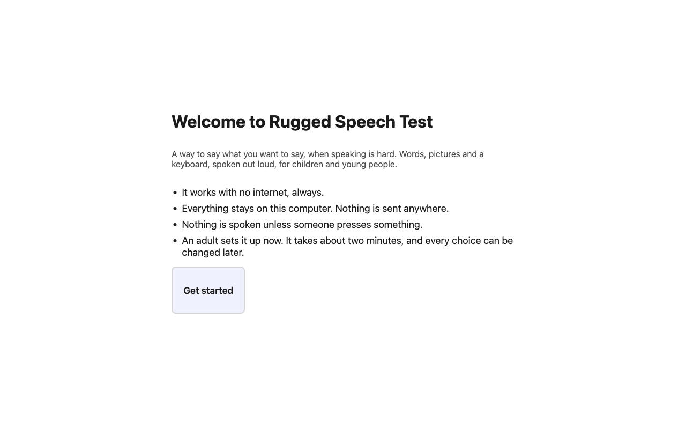
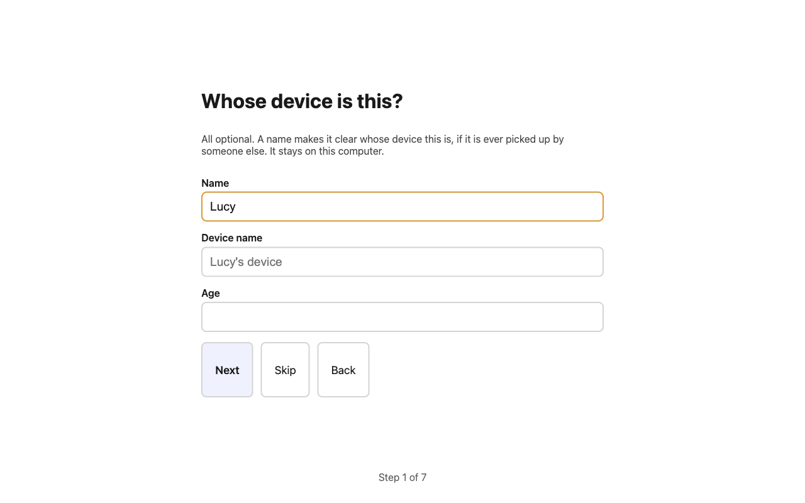
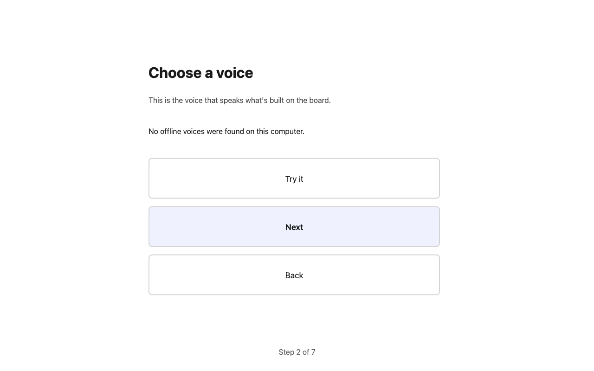
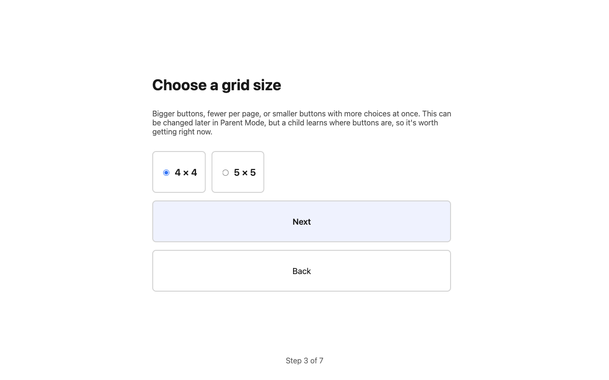
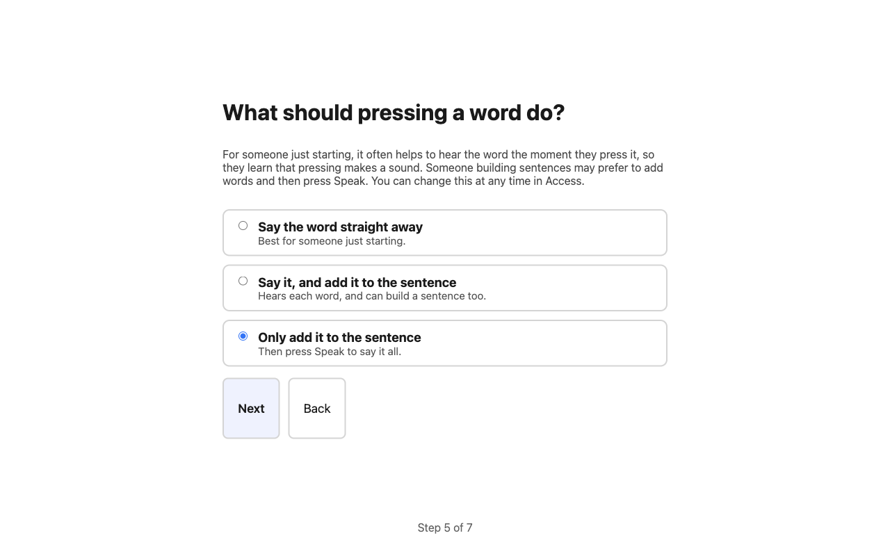
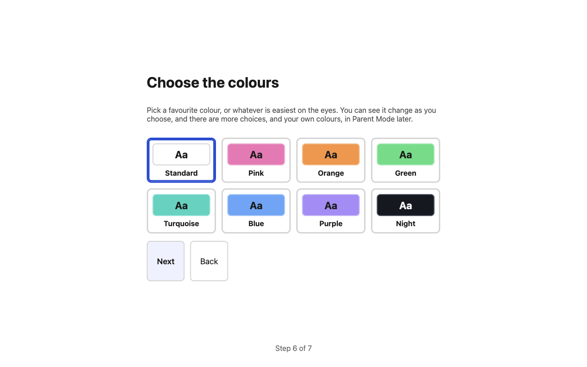
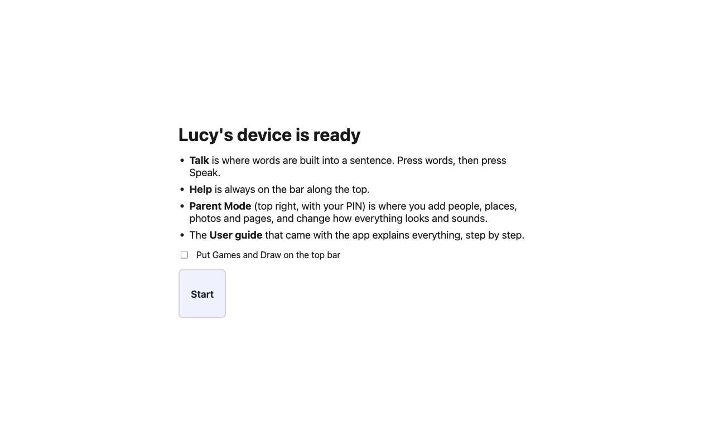

# Getting started: parents and carers

Rugged Speech Test is a communication companion for a child who finds speaking difficult. It has big buttons with pictures and words. When your child presses them, the app says the words out loud.

This guide takes you from nothing to a child using it, in about twenty minutes. You do not need to be good with computers.

> Everything stays on your computer. There is no account, no internet connection needed and nothing is sent anywhere. It works exactly the same with the wifi off.

## What you need

- A **Windows 10 or Windows 11** computer or tablet (64-bit). A touchscreen is ideal, but a mouse works.
- The installer: a single file called **Rugged Speech Test Setup 0.0.1.exe** (the number may be newer).
- About 10 minutes for set-up, and a quiet moment to choose a voice with your child if you can.

You do **not** need an internet connection, an account or an administrator password.

## 1. Install it

1. Copy the installer file onto the computer (from a USB stick, an email, or wherever you were given it).
2. Double-click it.
3. Windows may show a blue box saying **Windows protected your PC**. This is normal for new software that has not paid for a signing certificate. Press **More info**, then **Run anyway**.
4. Follow the steps. It installs just for you and does not ask for an administrator password.
5. When it finishes, **Rugged Speech Test** opens by itself. There is also a shortcut on the desktop and in the Start menu.

If you want to be sure the file is exactly the one that was sent to you, ask whoever gave it to you for its "SHA-256" code, then open a Command Prompt and type `certutil -hashfile "Rugged Speech Test Setup 0.0.1.exe" SHA256`. The two codes should match.

## 2. The first-run set-up

The first time it opens, a short set-up asks a few questions, one at a time. Every question can be changed later, so do not worry about getting it perfect. There is a **Back** button on each step.

**Welcome.** It tells you what the app is and that nothing leaves the computer. Press **Get started**.

**Whose device is this?** Type your child's name if you like (for example *Lucy*). The device is then called *Lucy's device* and the name shows along the top of the screen, so if the device is ever found by someone else it is clear whose it is. You can add an age, or leave everything blank and press **Skip**.

**Choose a voice.** Press each voice and **Try it** to hear it. Only voices that work without the internet are shown. Pick the one that sounds clearest, or friendliest, or the one your child reacts to best. You can change the speed and pitch later.

**Choose a grid size.** This is how big the buttons are on the Talk page. Fewer, bigger buttons are easier to press; smaller buttons show more at once. Once your child has learned where things are, try not to change it often, because **buttons always stay in the same place** and that is how a child learns them.

**Pictures and words.** Choose what the buttons show:

- **Drawn symbols** (simple, bold pictures made for this app) or **Emoji**.
- **Picture and word**, **Pictures only** (for a child who does not read yet) or **Words only**.
- How big the writing is.

You can see a few sample buttons change as you choose.

**What should pressing a word do?** This matters for how your child learns the app.

- **Say the word straight away** is usually best for someone just starting. They press a button, they hear the word at once, and they learn that pressing makes sound.
- **Say it, and add it to the sentence** hears each word and also builds a sentence at the top.
- **Only add it to the sentence** means pressing **Speak** says the whole sentence.

If you are not sure, a speech and language therapist can advise. You can change it at any time under **Access**.

**Choose the colours.** Pick a favourite colour (pink, orange, green, turquoise, blue or purple), or whatever is easiest on the eyes. There are more favourites, other looks and your own colours, later, in **Look**.

**Set a Parent PIN.** Choose four numbers and enter them twice. This protects the settings from being changed by accident. It is not a lock on the computer. The app then shows you a **recovery code** of four words.

> **Write the recovery code down now**, and keep it somewhere safe. It is the only way back in if you forget the PIN. Nobody, including the people who made the app, can find it for you.

**You are ready.** A short reminder of where things are. You can tick **Put Games and Draw on the top bar**. Press **Start**.

## 3. Look around the child's screen

- Along the **top** are six buttons that are always there: by default **Home, Help, Yes, No, Favourites, Keyboard**. **Help** can never be taken away, so it is always one press away.
- **Give me time** speaks "I know what I want to say. Please give me a moment." It is for a child who needs time. Nothing is ever said unless someone presses something.
- The big tiles on Home are **Talk**, **Keyboard**, **My Day**, **Favourites**, **My Pages** and **Feelings & Help**. They never move.
- On every screen except Home there is a **Home** button at the top left, in the same place.
- **Medical Info** and **Parent Mode** are at the top right.

Try **Talk** now. Press a few words and listen. Press a folder (like **Food**) to see more words, then **Back** or **Home** to return.

## 4. Make it theirs (ten minutes in Parent Mode)

Press **Parent Mode** at the top right and enter your PIN. A menu down the left has everything, grouped by what it is for. The first item, **User guide**, is the whole of this guide inside the app, so you never need to look anywhere else.

The most useful things to do first:

1. **People** and **Places**. Add the people and places that matter: Mum, Grandad, nursery, the park. You can add a **photo** (from the camera or a file) and even **record a voice** (your own voice, saying the name). A button appears on the Talk page, and when pressed it says the name in your voice. This is often the thing a child loves most.
2. **My body**. Make the figure look like your child (boy, girl or non-binary; skin and hair; clothes; a wheelchair; equipment such as hearing aids or a feeding tube). A child can then point to where it hurts. See [My body](#my-body-where-it-hurts) below.
3. **About me** and **Medical**. Write a short page for anyone who looks after your child, and the medical details that matter in an emergency. Anyone can read these from the child's screen with one press, so write only what you are happy for them to read.
4. **Quick Access**. Choose which six buttons are along the top. Break, Question, Toilet, Finished and Say again speak straight away. You can also add **Games**, **Draw**, **Music**, **Traffic light** and **My body**.
5. **Look**. Colours, and drawn symbols or emoji.
6. **School** (only if a school will use it). Turn on **School Mode** and choose a separate **School PIN** for the staff. See [Getting started: teachers and staff](getting-started-staff.md).
7. **Access**. The voice (speed, pitch, volume), how a sentence is read out, and ways to help with pressing (a longer hold, ignoring accidental double presses, switch scanning).

### My body: where it hurts

On the child's screen, **Feelings & Help** has a **My body** tab. A child presses the part that hurts (on the picture or in the list), then how it feels (hurts, sore, itchy, too tight, not working) and how much, then **Say it**: *"My tummy hurts a lot."*

It is safe for young children. The figure is always dressed, and the private area is only ever called **Under my pants**, with no pictures of bodies. Nothing the child points to is saved.

If you add equipment (hearing aids, a pump, a feeding tube, leg braces and others), each one appears on the figure and can be pointed to: *"My pump is not working."*

> If a child tells you something that worries you, follow your own safeguarding steps. The app does not tell anyone anything, and does not record these words any differently from any others.

## 5. Things to enjoy together

**Games** (add it to the top bar in Quick Access, or tick it at the end of set-up):

- **Find the word**: match a word to a picture. There is no clock and no score. After two wrong tries the right word is pointed to.
- **Snap**: turn the cards and press SNAP for two the same.
- **Rollercoaster**: build short sentences to climb each hill. Choose two, three or four words.
- **Draw**: colours, three brush sizes, Undo, and you can keep your pictures.
- **Jokes**: very simple jokes you can say, and you can add your own.
- **Music**: songs you add from files on the computer (MP3s and similar).
- **Piano**: eight big coloured keys, and tunes to follow.

Nothing in a game speaks or plays unless your child presses something.

**Traffic light** lets your child show people, without a word, how much they want to be spoken to: red, amber or green. You can change the words it says.

## 6. Keep it safe

- **Back it up.** In Parent Mode, **Backup** saves one file with everything in it (photos, pages, settings). Save it somewhere safe, such as a USB stick. You can protect it with a passphrase. Do this after setting up, and again from time to time. The app reminds you if it has been a month.
- **Lost mode.** If the device goes missing, **Lost mode** covers the screen with who to return it to. Type the details in advance, in Parent Mode, under **Lost mode**.
- **Medical Info.** Fill it in, so anyone who finds your child can press **Medical Info** and see what they need, including a code a phone camera can read.
- **The PIN is not a lock.** A child can still switch to other programs. The PIN only keeps the settings safe.

## 7. A few good habits

- **Wait.** After you ask something, give plenty of time before asking again.
- **Show, do not test.** Press the buttons yourself as you talk ("I **want** a **drink**") so your child sees how it is used. Speech and language therapists call this modelling, and it is one of the best things you can do.
- **Keep buttons where they are.** Learning where a button is is how a child gets fast.
- **Start small.** A few words your child really wants (more, drink, help, stop) beat a page full of words.
- **Ask for help.** A speech and language therapist can look at the vocabulary and settings with you. The starter words are a sensible beginning, not a prescription.

## If something goes wrong

| What happened | What to do |
| --- | --- |
| I forgot the PIN | On the PIN screen press **Forgotten your PIN?** and type the recovery code you wrote down. |
| The app closed by itself | Open it again. The sentence being built and the page you were on come back. |
| There is no sound | Turn up the computer's volume, then check **Access → Voice volume** and **Voice**. Press **Hear this voice**. |
| A button is in the wrong place | In Parent Mode, **Boards**, drag the button, or use the up and down arrows. |
| I want to start again | **Boards** has **Put this board back to the starter version** for each page. |
| I want to remove it | Use Windows **Add or remove programs**. It asks whether to keep or delete your child's saved pages, photos and settings. |

More detail on everything is in [the whole guide](user-guide.md). For teachers and staff, see [Getting started: teachers and staff](getting-started-staff.md).
