# Rugged Speech Test: the whole guide

A guide for the parents, carers, teachers and therapists who set up and use Rugged Speech Test with a child or young person. It describes every part of the app. If you are new, start with the shorter guides:

- [Getting started: parents and carers](getting-started-parents.md)
- [Getting started: teachers and staff](getting-started-staff.md)
- A one-page printable [setup sheet](setup-sheet.md)

Rugged Speech Test is a communication companion for when speaking is difficult, unreliable or tiring. It helps someone say what they want to say by pressing large buttons, typing, pointing, or showing their words. It is made for young children and for children with limited speech, and it works for people who rarely speak and for people who speak most of the time but sometimes get stuck, including those who stammer.

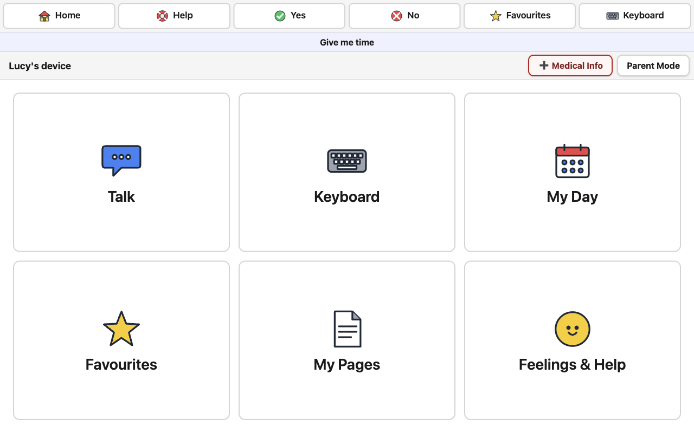

## Contents

1. [Before you start](#1-before-you-start)
2. [Installing](#2-installing)
3. [First run](#3-first-run)
4. [Finding your way around](#4-finding-your-way-around)
5. [Using each part](#5-using-each-part)
6. [Parent Mode](#6-parent-mode)
7. [School Mode](#7-school-mode)
8. [Setting it up well](#8-setting-it-up-well)
9. [Privacy, safety and security](#9-privacy-safety-and-security)
10. [If something goes wrong](#10-if-something-goes-wrong)
11. [Quick reference](#11-quick-reference)

---

## 1. Before you start

**Four things worth knowing from the start:**

- **Nothing is ever spoken unless someone presses something.** The app never guesses, never finishes a sentence for anyone, and never speaks over them. (There are three small, clearly described exceptions in Calm and My Day, listed in [section 5](#the-three-things-that-speak-without-a-fresh-press).)
- **Buttons stay where they are.** A child learns where things are, and that matters more than almost anything. Nothing moves on its own: not when the window changes size, not when you hide a button. Only an adult, deliberately, in Parent Mode.
- **Everything stays on the computer.** There is no account, no cloud, no internet connection used and nothing sent anywhere, ever. It works exactly the same with the network cable pulled out.
- **The Parent PIN does not lock the computer.** It protects the settings and editing screens from being changed by accident. Anyone can still switch to another program with Alt+Tab or the Windows key (Command+Tab on a Mac). If you need the computer itself locked down, that is a separate kind of set-up.

**What you need:** a Windows 10 or Windows 11 computer or tablet (64-bit), or a Mac. A touch screen is helpful but not required; a mouse or keyboard works too, and so do switches (see [Access](#access)).

**A word about the words.** The starter vocabulary is a small set of the first words a young child uses. It is a sensible beginning, **not a clinical prescription**. Which words matter for a child is a professional decision, so please review them with a speech and language therapist.

---

## 2. Installing

1. Copy the **Rugged Speech Test Setup** file (for example *Rugged Speech Test Setup 0.0.1.exe*) onto the computer, from a USB stick, a shared drive, or wherever it was given to you.
2. Double-click it. Windows may show a blue **"Windows protected your PC"** screen. Click **More info**, then **Run anyway**. This is normal for new software that has not been through Windows' paid signing process. It does not mean anything is wrong.
3. Follow the installer. It does **not** need an administrator password. It installs just for the person who is signed in, and lets you choose the folder.
4. When it finishes, Rugged Speech Test opens on its own. A shortcut is added to the desktop and the Start menu.

**Checking the file.** If you want to be sure the file is exactly the one you were sent, ask for its SHA-256 code and compare it with the one from a Command Prompt: `certutil -hashfile "Rugged Speech Test Setup 0.0.1.exe" SHA256`.

**On a Mac.** Copy the disk image for your Mac (**Rugged-Speech-Test-0.0.1-mac-arm64.dmg** for Apple silicon, **-mac-x64.dmg** for an Intel Mac), open it, and drag **Rugged Speech Test** onto **Applications**. The first time, the Mac will say it cannot be opened, because the app is not yet signed with an Apple Developer ID. Go to **System Settings**, **Privacy & Security**, and press **Open Anyway** (on macOS 14 or earlier, Control-click the app and choose **Open**). After that it opens normally. Checking the file: `shasum -a 256` on the disk image, compared with the code you were given.

**Updating.** There is no automatic update, by design, because the app never goes online. A new version arrives as a new installer file. Run it over the old one and your child's saved pages, photos and settings stay.

**Where your data is.** On Windows, in the folder **Rugged Speech Test** inside your **AppData\Roaming** folder, for the person who is signed in. On a Mac, in **Library/Application Support/Rugged Speech Test** in your home folder. A backup file is the safe way to move or keep it.

**Removing it:** on a Mac, drag the app to the Bin (and delete the data folder above if you want the saved things gone). On Windows, use the usual **Add or remove programs**. It will ask whether to **keep** or **delete** the saved boards, photos and settings. Choose keep if the computer might be used again, or delete if you are finished with it.

---

## 3. First run

Each time it opens, a still "Getting ready" screen shows for a moment while the saved settings load. There is no spinner, because the app has no movement.

The first time it opens, a short set-up asks one question at a time. Every answer can be changed later, and every step after the first has a **Back** button. It takes about two minutes.

| Step | What you choose |
| --- | --- |
| **Welcome** | Nothing: it says what the app is and that nothing leaves the computer. |
| **Whose device is this?** | A name, a device name and an age, all optional. A name makes the device "Lucy's device" and shows it along the top of the screen. |
| **Choose a voice** | Which voice speaks. Only voices that work without the internet are listed. Press **Try it**. |
| **Choose a grid size** | How big the buttons are on the Talk page (fewer, bigger buttons or more, smaller ones). |
| **Pictures and words** | **Drawn symbols** or **emoji**; **picture and word**, **pictures only** or **words only**; and the size of the writing. Drawn symbols are chosen to begin with. |
| **What should pressing a word do?** | Say the word straight away, say it and add it to the sentence, or only add it. |
| **Choose the colours** | A favourite colour (pink, orange, green, turquoise, blue or purple), the standard look, or the dark one. More are in Look later. |
| **Set a Parent PIN** | Four numbers, entered twice. |
| **You are ready** | A short reminder of where things are, and a tick-box to put **Games and Draw** on the top bar. |

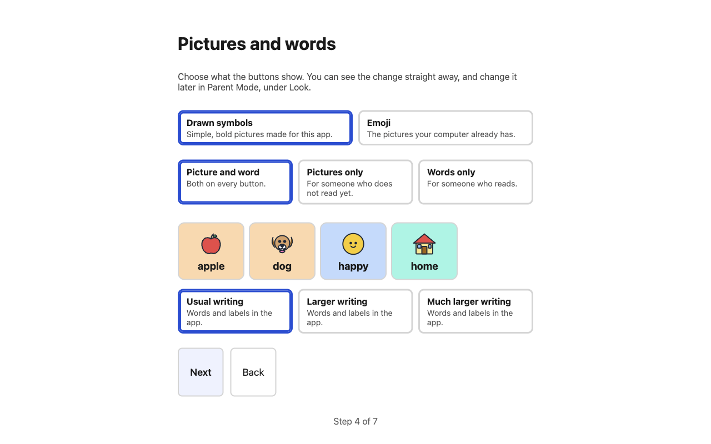

After the PIN you are shown a **recovery code** of **four words** joined by dashes, for example `copper-meadow-ember-lantern`. **Write it down and keep it safe.** It is the only way back in if the PIN is forgotten, and nobody, including the people who made this app, can recover it any other way.

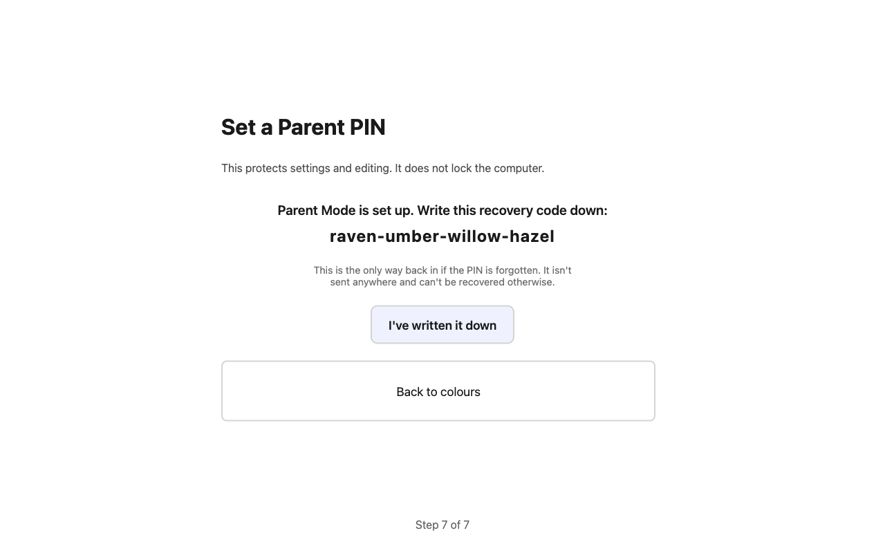

---

## 4. Finding your way around

### The top of every screen

The same controls are always there, in the same places, whatever the child is doing.

| Control | What it does |
| --- | --- |
| **Quick Access bar** (six buttons) | Starts as **Home, Help, Yes, No, Favourites, Keyboard**. Yes and No speak straight away; the others take you there. An adult can choose different buttons ([Quick Access](#quick-access)), including ones that speak straight away (**Break, Question, Toilet, Finished, Say again**) and ones that open **Games, Draw, Music, Traffic light** and **My body**. **Help always stays on the bar.** |
| **Give me time** | Speaks: "I know what I want to say. Please give me a moment." It works from every screen, including in the middle of typing, and does not disturb anything on screen. |
| **Home** (top left, on every screen except Home) | Goes back to the Home screen. It is in the same place on every screen. |
| **The device's name** (for example *Lucy's device*) | Shows whose device it is. An adult can turn it off ([User](#user)). |
| **Traffic light marker** | A small coloured marker, when the child has chosen one. See [Traffic light](#traffic-light). |
| **Medical Info** | Shows the child's name, allergies, conditions, medicines, emergency plan and contacts, as text and as a QR code. No PIN needed. See [Medical Info](#medical-info). |
| **About me** (when there is something to show) | A short page for anyone new to supporting this person. No PIN. See [About me](#about-me). |
| **Parent Mode** | One press, then the PIN. See [section 6](#6-parent-mode). Next to it, once switched on, is a separate [**School Mode**](#7-school-mode) button with its own PIN. |

### The Home screen

Six large tiles, always in this order:

| | | |
| --- | --- | --- |
| **Talk** | **Keyboard** | **My Day** |
| **Favourites** | **My Pages** | **Feelings & Help** |

Each has a picture beside its name, so a child who does not read yet can tell them apart. The picture follows the choice of drawn symbols or emoji.

---

## 5. Using each part

### Talk

The main board: a four-by-four grid of large, colour-coded word buttons, with folders for **Food, Feelings, Play, People, Places** and **Doing**.

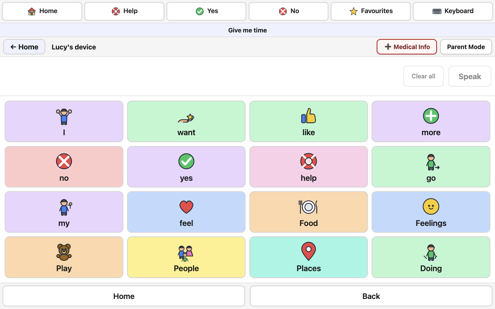

- **Press a word.** What happens depends on a setting an adult chose: it is **added to the sentence strip** along the top, or **said straight away**, or both ([Access](#access)).
- **Press Speak** to say the whole sentence. A sentence can be read out all together, with small gaps, or **one word at a time, lighting each word as it is said**.
- **Press a word in the strip** to take it out. **Clear all** empties the strip.
- **Press a folder** (a button such as **Food** that opens another board) to go into it. It is not added to the sentence. **Back** goes up one level; **Home** returns to the Home screen.
- **Hold a button down for a moment** until you hear "Added to Favourites" to save it as a favourite. (The word is not added to the sentence when you do this.)
- A word with a **blue outline** is a **focus word**: one an adult or therapist is currently working on.
- A space with no button is not an error. A word may be hidden, or held back until a later [word stage](#learning). Every other button stays exactly where it was.

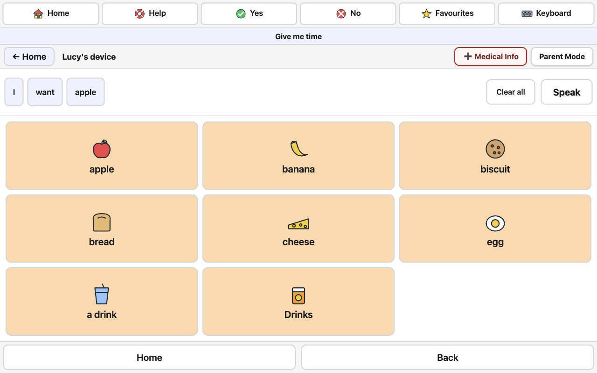

Each folder holds nine things or fewer, in large buttons, so there is never a crowd to search. **Doing** holds the few words that go with everything (*stop, look, all done, again, open, that, not*) and a few everyday actions (*eat, drink, sleep, wash, toilet, sit*).

**Colours mean something.** Button colour shows the kind of word, which helps a child learn where to look: people yellow, doing green, describing blue, things orange, places teal, social pink, little words purple, no/stop red. An adult can change each colour in [Look](#look).

**Picking up where you left off.** If the app closes unexpectedly, the sentence in progress and the page you were on are restored when it reopens. Pressing **Home** on the Talk screen itself is a deliberate "finish", so it starts fresh next time.

### Keyboard

For typing what someone wants to say. It has three tabs:

- **Keyboard**: a large on-screen keyboard (numbers too), with a **suggestion bar** above it. Suggestions are only ever suggestions: they never change the text unless you press one, and they never speak. They are based on the words in the app and on the suggestions that have actually been chosen before. The keyboard also learns the **names of the people and places** an adult has added. An adult can put the letters in **alphabetical order** ([Access](#access)).
- **Phrases**: four saved phrases that are often hard to say out loud: **Name, Address, Usual order** and **Register answer**. Type each in once; after that **Speak** says it with one press. Under **More phrases** you can add as many others as you need, each with its own **Speak** and **Remove**.
- **Starters**: ready-made phrases for **Phone, Counter, School** and **Meeting people** ("Can I pay by card?", "Can you repeat that please?"). Press one to say it.

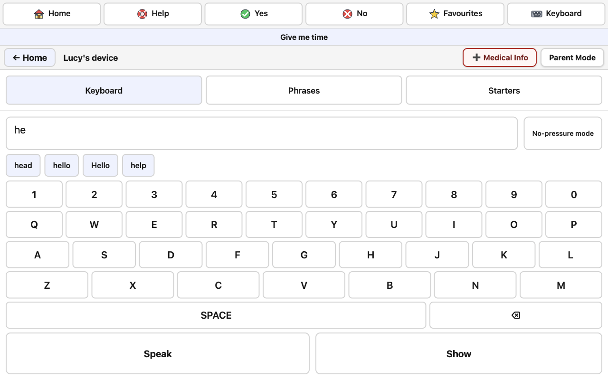

Two buttons help when speaking is the hard part:

- **Show** puts the text on the screen in very large letters, silently, so it can be held up for someone to read. Press the screen to put it away.
- **No-pressure mode** strips the screen down to just the text box, the keyboard and **Speak**: no suggestions, no tabs, nothing to rush you. Press **Exit no-pressure mode** to come back.

### My Day

A picture of the day, built ahead by an adult ([My Day](#my-day-1)).

- **Today** shows the activities in order, with the current one clearly marked and finished ones moved to a **Finished** list. An adult can instead choose **Now / Next / Later**, a simpler three-part view.
- **Press an activity** to ask about it: **What's next? · When? · Where? · Who with? · Finished.** The answers are spoken ("Swimming at 2:00pm"). **Finished** moves the activity down.
- An activity can have a **picture**.
- **Change of plan.** When an adult edits an activity's name, the child's screen shows the old name crossed out beside the new one and says, once, "The plan has changed. We are going to Grandma's instead."
- **Countdown warnings** (off unless an adult turns them on) say "2 minutes until swimming" and "1 minute until swimming". They are off by default because, for some children, a countdown raises anxiety rather than lowering it.
- The day rolls over at midnight on its own.
- If an adult has entered a **weekly routine** (a timetable), any day without its own plan already has it filled in.

### First / Then

A two-card screen: **First** this, **Then** that ("First brush teeth, then tablet time"). An adult sets it up in **My Day** and puts it on the top bar ([Quick Access](#quick-access)). The card to do now is outlined. When the child presses **First is finished**, the first card is marked done, the second becomes the one to do, and it says "All done. Now …" once, because a person pressed the button. **Start again** puts it back to the beginning. It is remembered if the app is closed.

### Favourites and Recent

- **Favourites** are one-press buttons that speak straight away. It starts with a handful of common words (I, want, like, more, help, yes, no). Add more by holding a button on the Talk board or in My Pages. An adult can take any away under **General**.
- **Recent** is a list of what has been said, and **it is off by default.** An adult can turn it on ("Recent history: On"), and it then remembers the last 50 things said, for up to 7 days, on this device only. **Clear** empties it. Press an entry to say it again.

### My Pages

Pages an adult builds from scratch for anything the starter words do not cover: a special interest, a trip, a person's name, a school topic. Press a word to add it to the sentence, then **Speak**, exactly as in Talk.

- With **one** page, the My Pages tile opens it directly.
- With **several**, you first pick a page. **Back** returns to the list.
- Until an adult makes one, it says **"No pages yet"**.

### Feelings & Help

Four tabs: **Feelings**, **Help**, **Calm** and **My body**.

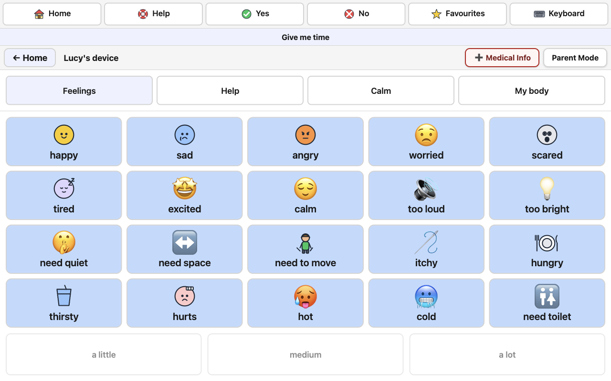

- **Feelings**: emotions, and things the body or senses need (**too loud, too bright, need quiet, need space, need to move, itchy, hungry, thirsty, hurts, hot, cold, need toilet**). Press one and it says "I feel worried". Then press **a little**, **medium** or **a lot** to say "I feel worried, a lot".
- **Help**: nine phrases a child may urgently need: **I'm lost · I feel unsafe · I'm hurt · I feel unwell · Call my parent · I need the toilet · Someone hurt me · Don't touch me · I don't know where I am.** Each one speaks straight away. **Help is always one press away from every screen** via the Quick Access bar.
- **Calm**: a **breathing guide** (press **Start** and it says "Breathe in", "Hold", "Breathe out" at an even pace, and keeps going until you press **Stop**) and **quiet time** (choose **1, 2 or 5 min**; it counts down and says "The timer's finished. Take your time." when done).
- **My body**: see below.

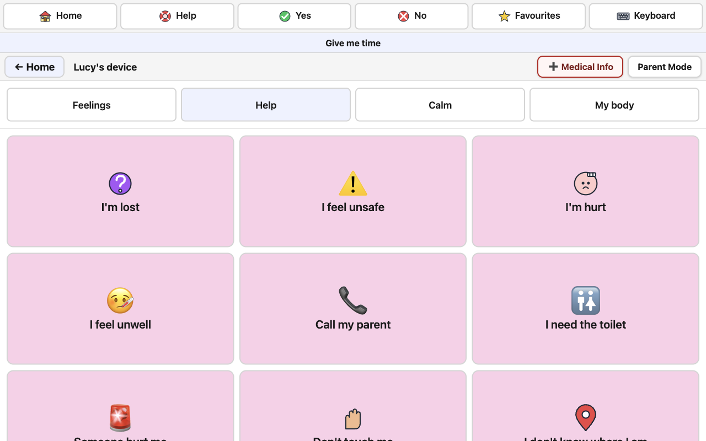

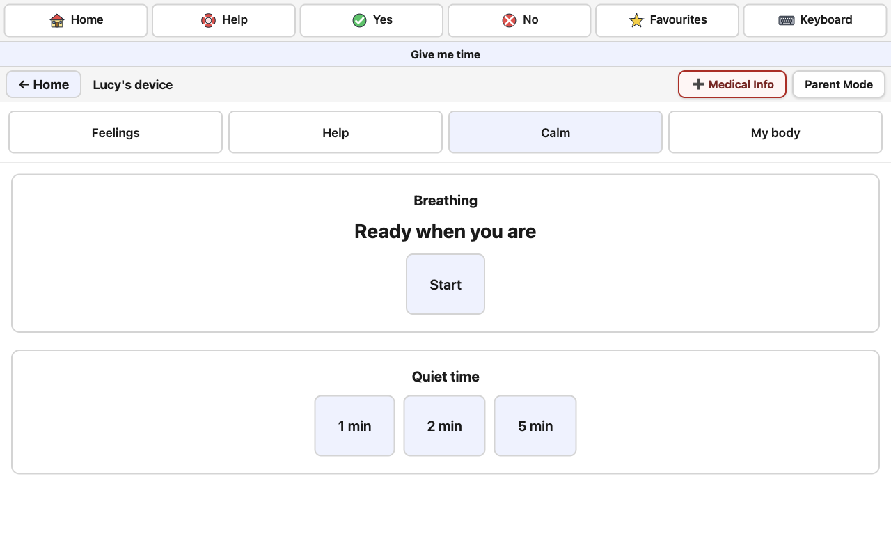

> "Call my parent" **only speaks those words.** It does not place a call or send a message to anyone. See [Privacy, safety and security](#9-privacy-safety-and-security).

### My body

Point to where it hurts. The child sees a figure that looks like them, presses the part of the body, says how it feels, and says how much.

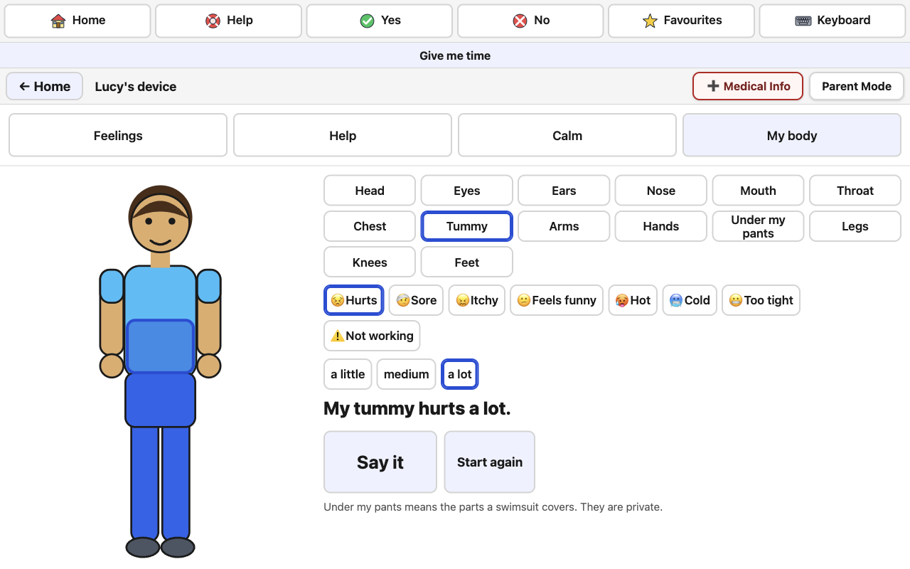

1. **Where?** Press a part of the body, on the picture or in the list: head, eyes, ears, nose, mouth, throat, chest, tummy, arms, hands, **under my pants**, legs, knees, feet. **Turn round** (**See my back**) shows the back: neck, back, lower back and the rest. Each part you press is said ("My tummy.") and lit.
2. **What is it like?** Press how it feels: *hurts, sore, itchy, feels funny, hot, cold, too tight, not working*.
3. **How much?** Press how much: *a little, medium, a lot*.
4. **Say it**: "My tummy hurts a lot." Several parts make one sentence ("My head and my tummy hurt."). **Start again** clears it.

If the child uses **equipment** (hearing aids, a cochlear implant, an oxygen tube, a neck tube, a tummy tube, a pump, a sensor, leg braces), each appears on the figure and can be pointed to: "My pump is not working." The adult chooses these in [My body (tab)](#my-body-tab).

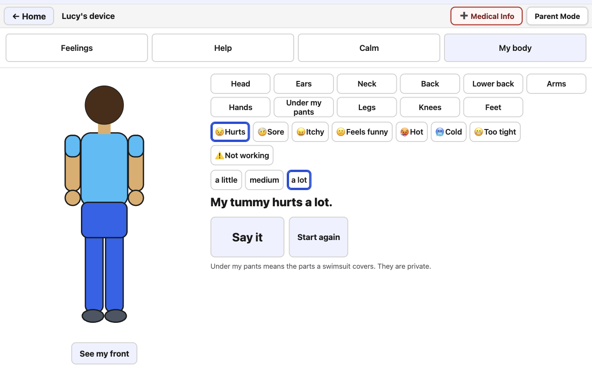

**It is made safe for young children.** The figure is always dressed. The private area is only ever called **Under my pants**, and there are no pictures of bodies. Nothing that is pointed to is saved, and what is said is kept like anything else that is said (and not at all unless Recent or Activity are on), not marked out in any way. The app does not tell anyone anything, so if a child tells you something that worries you, follow your own safeguarding procedure.

### Games

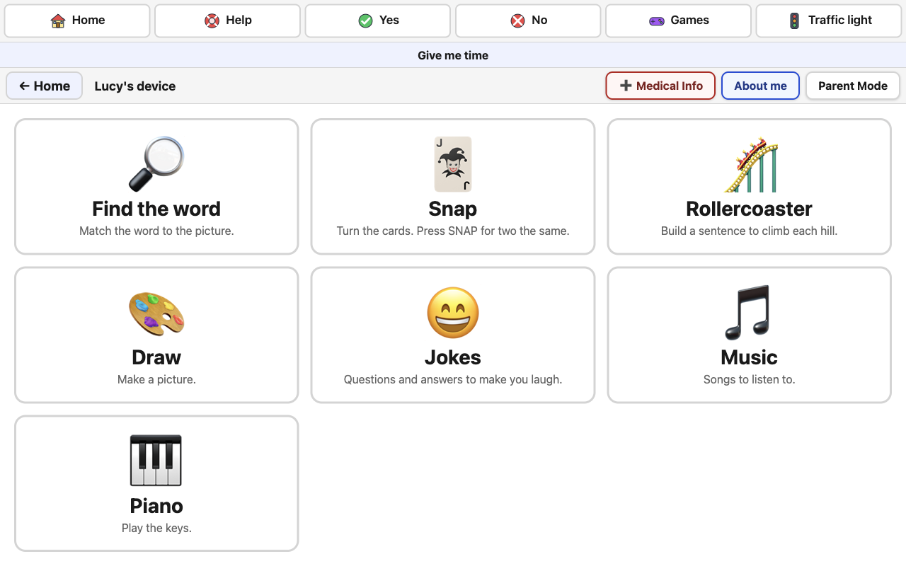

Games are for fun and for practice. None keeps a score against anyone, none has a clock, none moves or flashes, and none speaks unless a button is pressed. Put **Games** on the top bar in [Quick Access](#quick-access), or tick it at the end of set-up. **All games** (top left) always goes back to the menu.

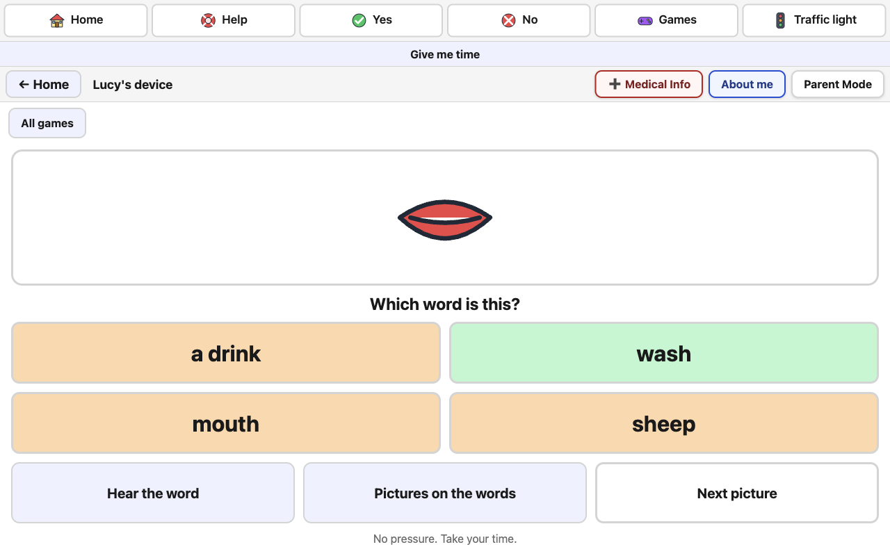

- **Find the word.** A picture and four words. Press the word that goes with the picture. A word that is not right is marked as tried; after two wrong tries, the right word is pointed to. **Hear the word** says it. **Pictures on the words** helps.
- **Snap.** Turn a card; if it is the same as the one before, press **SNAP!** Pressing a card says its word. There is no other player to beat.

  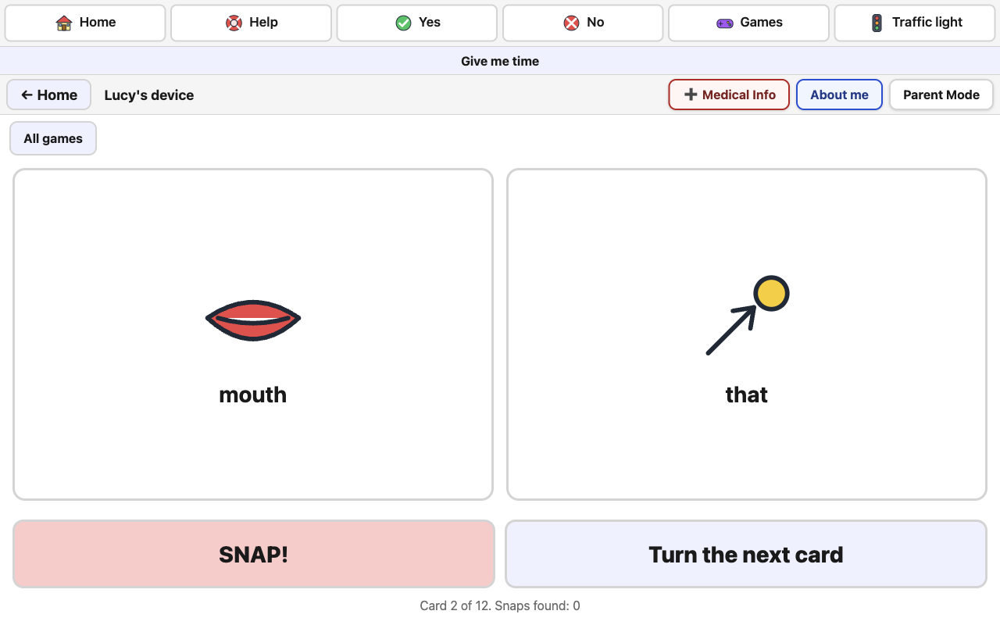

- **Rollercoaster.** Build a short sentence for each hill of the ride. Choose **two words** (*want ball*), **three** (*I want ball*) or **four** (*I want big ball*), and a **short** or **long** ride. Press the words; each moves the train along the track. Every word is said as it is pressed, and **Say it all** says the sentence. Each finished sentence becomes a ticket, and at the end **Say my sentences** says them all.

  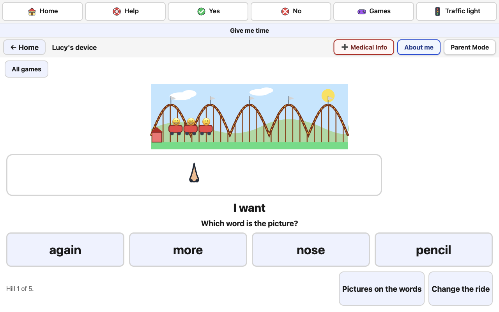

- **Draw.** A blank page, twelve colours, three brush sizes, **Undo**, and **Start again** (which can itself be undone). **Keep** saves a picture, and **My pictures** shows the ones you kept (up to twelve; **Throw this one away** makes room). Pictures stay on this computer.

  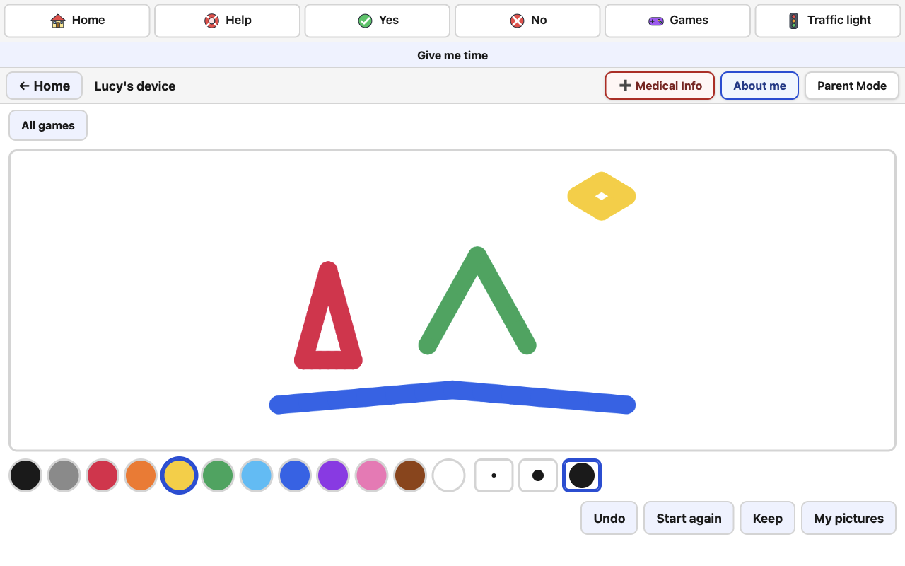

- **Jokes.** A very simple question, then the answer when you ask for it, from a list of short, kind jokes. **Make a silly one** mixes a question with a different answer. An adult can add jokes ([Jokes](#jokes)).

  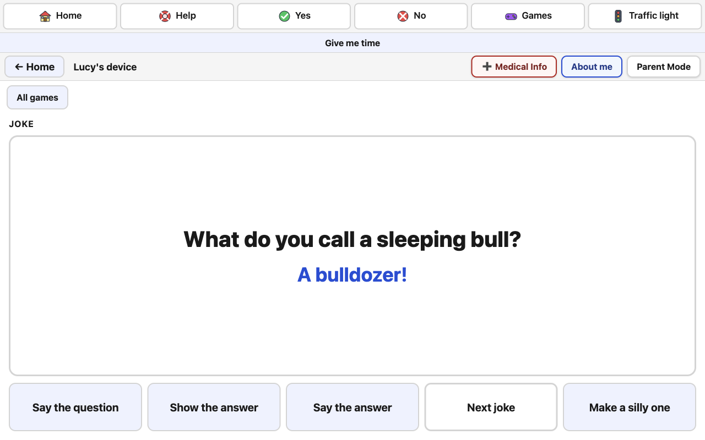

- **Music.** A tile for each song an adult has added ([Music](#music)). Press one to play; **Pause** and **Stop** are always in the same place. Songs never play by themselves, and leaving the screen stops the music. If an adult has made **playlists**, they are choices along the top (**Everything** first). Choose one to see just its songs, and press **Play all** to play it through once, in order. It stops at the end.
- **Piano.** Eight big coloured keys, C to the C above. Press a key and it plays. Choose a tune (*Hot cross buns, Mary had a little lamb, Twinkle twinkle, Ode to joy, Row row row your boat*) and the next key to press is outlined and pointed to. Pressing a wrong key just plays that note. **Hear it** plays the tune slowly. A computer keyboard's **A S D F G H J K** keys play too.

  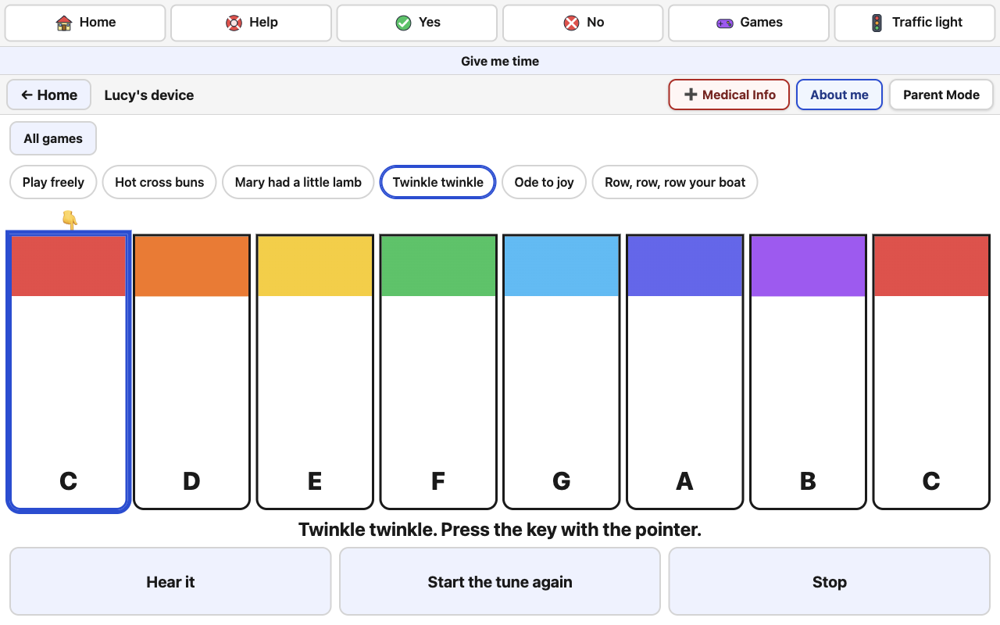

- **Seasons.** Words and games for times of the year and celebrations: **Spring, Summer, Autumn, Winter, Christmas, Easter, Halloween, Bonfire Night, Diwali, Eid** and **Hanukkah**. They stay in this order. The one that suits today's date is only marked **Now**; Diwali, Eid and Hanukkah follow the moon, so they are never marked, and a family chooses them. An adult chooses which ones show, and can change the words, in [Seasons](#seasons-tab) in Parent Mode. One that is left out leaves its place empty, so nothing else moves. For each, choose **Words** (big buttons that say the word when pressed), **Find the word**, or **Snap**, played with that season's words. Bonfire Night includes **ear defenders** and **too loud**.

  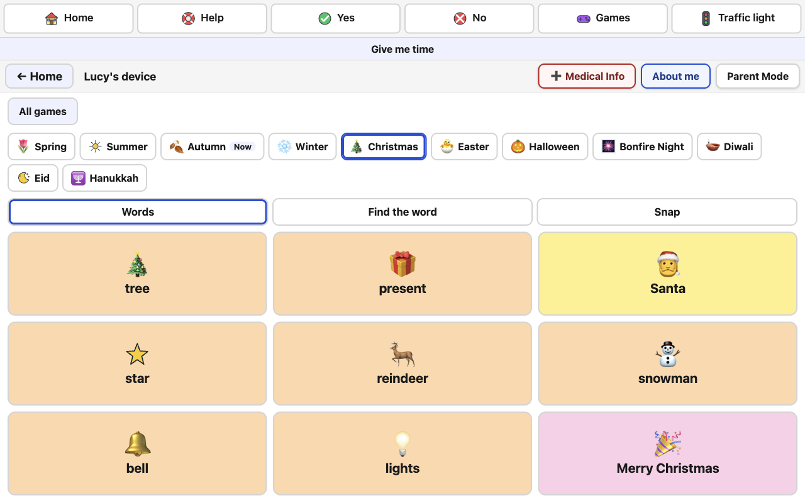

- **Make a tree.** A Christmas tree to decorate. Choose a decoration (a star, five colours of bauble, a light, a bell, a sweet, or a present), then press a place to hang it. The star goes on the top and presents go under the tree. **Take off** removes one, **Undo** takes back the last thing, and **Start again** clears the tree (and can be undone). The places never move, and the tree is still there next time. Nothing is scored.

  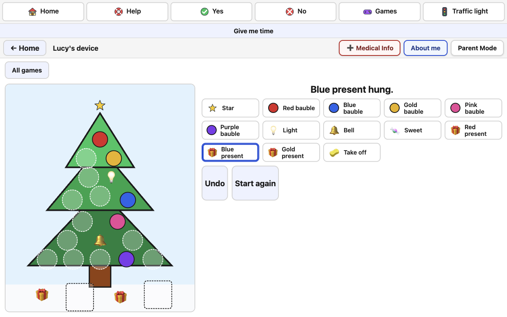

### Traffic light

A way to show other people, without a word, how much you want to be spoken to. Add **Traffic light** to the top bar in [Quick Access](#quick-access).

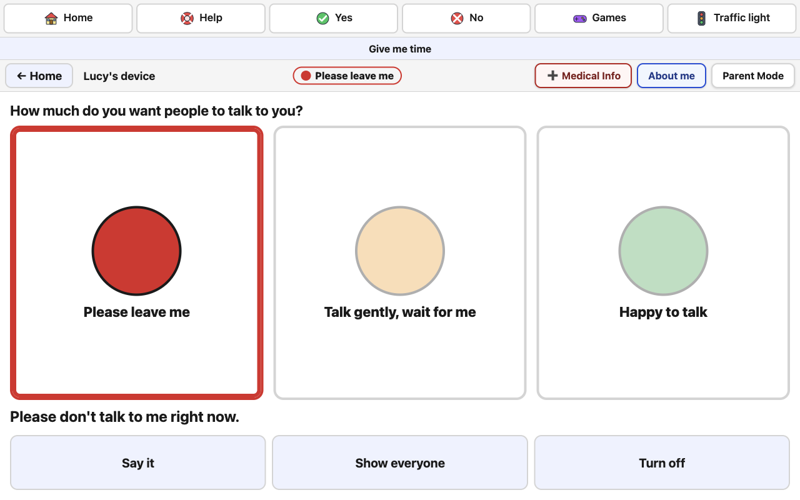

- **Red**: "Please don't talk to me right now."
- **Amber**: "You can talk to me, but please be gentle and give me time."
- **Green**: "I'm happy to talk to you."

Press a colour to show it. It stays until it is changed, and a small marker shows along the top of every screen. **Say it** speaks the words (only when pressed), **Show everyone** fills the whole screen with the colour and the words so others can read it, and **Turn off** clears it. An adult can change the words ([User](#user)).

### Medical Info

The red **Medical Info** button is on every screen and needs no PIN, so a stranger who has found a child who is lost can read it straight away. It shows the details an adult entered ([Medical](#medical)) as text and as a **QR code** that a phone camera can read. The QR code holds the information itself; no internet is used, and nothing is looked up. If nothing has been entered, it says so.

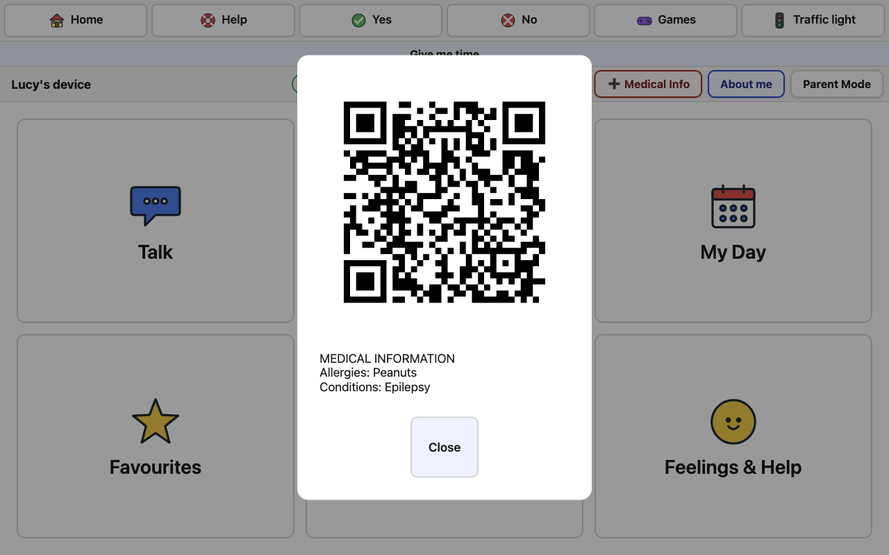

**Scanning it.** Open the phone's camera and hold it steady about 20 to 30 centimetres from the screen, with the whole code in view. The text appears on the phone as plain words, including accented letters, with no app needed. The code is always black on white whatever colour setting the app is on. A long record is shortened in the code to what matters most (name, allergies, conditions, medicines, equipment, how the child communicates, the emergency plan, NHS number and contacts); the screen always shows everything.

### About me

A short page for anyone new to supporting this person: a new teacher, supply staff, a relative or a respite carer. It appears as an **About me** button once an adult has written something (and once School Mode is on, in School Mode too). Press it to read: what the person likes to be called, **how they communicate, what helps, what they find hard, what they like and don't like.** No PIN is needed, and sections that were left empty are not shown.

### Lost mode

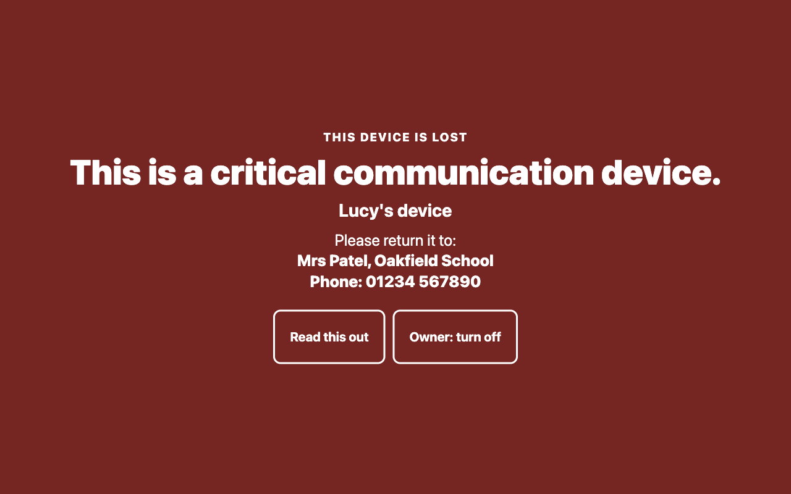

If an adult has turned **Lost mode** on, the whole screen is covered by a message: **"This is a critical communication device."** and who to return it to, with a phone number and address if they were typed in. **Read this out** says it aloud. **Owner: turn off** asks for the Parent PIN. Nothing else can be reached until then. See [Lost mode (tab)](#lost-mode-tab).

### The three things that speak without a fresh press

Everything above speaks only when someone presses something, with these exceptions, each of which follows a deliberate action:

1. **Breathing** and **quiet time** in Calm keep speaking their steps after someone has pressed **Start**.
2. **My Day's "plan has changed" announcement**, once, after an adult has edited an activity.
3. **My Day's countdown warnings**, only if an adult has turned them on.

---

## 6. Parent Mode

Parent Mode is where an adult sets everything up. The child's screen stays simple; all the settings live here, behind the PIN.

**To open it:** press **Parent Mode** (top right on every screen), then enter your 4-digit PIN. After five wrong tries in a row, the keypad makes you wait (30 seconds, then longer) before another try.

**To leave it:** press **Exit Parent Mode** (top right). You return to the child's screen. **Fullscreen: Off/On** is also there at the top; the app normally opens in a maximised window, and fullscreen is an adult's choice. It can also close itself after some minutes without use ([General](#general)).

**The menu.** A menu down the left holds every section, in groups:

| Group | Sections |
| --- | --- |
| **Start here** | User guide |
| **About the child** | User · About me · Medical · My body |
| **Words and pages** | Boards · People · Places · My Pages · Quick Access · Profiles |
| **Day and fun** | My Day · Music · Jokes · Seasons |
| **How it looks and works** | Access · Look |
| **Learning and school** | Learning · Targets · Notes · Activity · Reports · School |
| **Safety and data** | Lost mode · Backup · Print · General |

If it has been a while since the last backup and there is something worth protecting (photographs, people, pages), a note appears at the top with a button to take you to **Backup**.

**Forgotten the PIN?** On the PIN screen press **Forgotten your PIN?** and enter the recovery code you wrote down. You will then choose a new PIN, and a new recovery code is shown.

### User guide

This guide, inside the app, with every picture, working with no internet. Choose **parents and carers**, **teachers and staff** or **the whole guide**, search it, and jump to a part from the list on the left.

### User

Whose device this is. All of it is optional and stays on this computer.

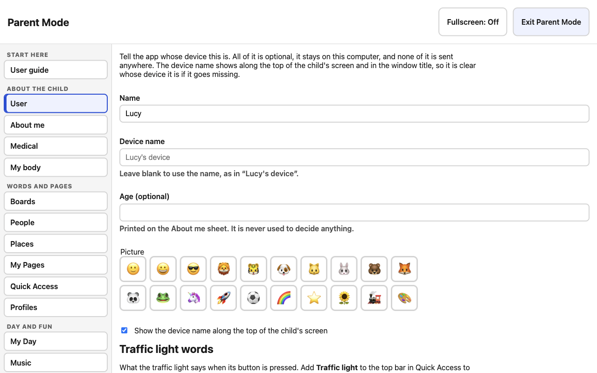

- **Name**, **Device name** (left blank, it becomes *Lucy's device* from the name) and **Age** (printed on the About me sheet; never used to decide anything).
- A **picture** (an emoji) for the device.
- **Show the device name along the top of the child's screen.** The name is also the window's title.
- **Traffic light words**: what each colour says.

### About me (tab)

Write the **About me** page: what the person likes to be called, how they communicate, what helps, what they find hard, what they like and don't like. A **preview** shows exactly what will appear, and **Print this page** prints it on one sheet. Only write what you are happy for a new member of staff or a relative to read, because anyone can open it from the child's screen without the PIN.

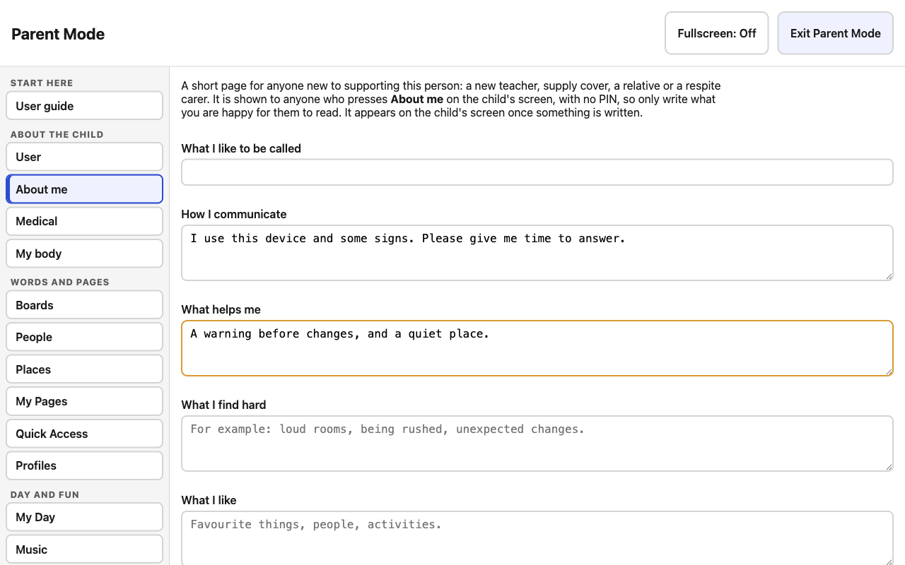

### Medical

Fill in the **child's name**, **allergies**, **conditions** and **emergency contacts** (a name and phone number each; add as many as you need), and then, if you like, more about their health: **medicines, equipment and aids, eating and drinking, moving about, hearing and sight, how they communicate, how they show pain or being unwell, what to do in an emergency, doctor or surgery, hospital and consultant, and NHS number.**

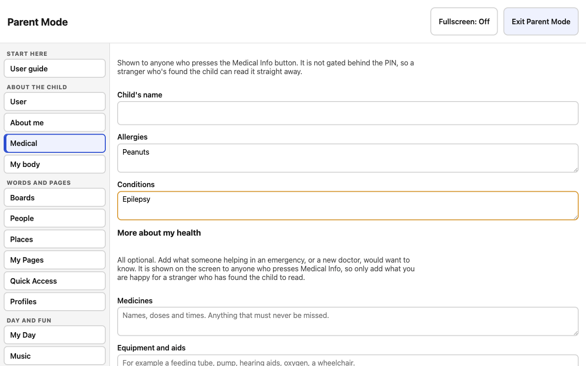

A **preview** shows exactly what the Medical Info button and its QR code will show. Entries save as you type. Everything here is visible, without the PIN, to anyone who presses **Medical Info**, so only enter what you are comfortable with a stranger who has found the child reading.

### My body (tab)

Make the figure on [My body](#my-body) look like the child. The child finds it in **Feelings & Help**, and you can also put it on the top bar in Quick Access.

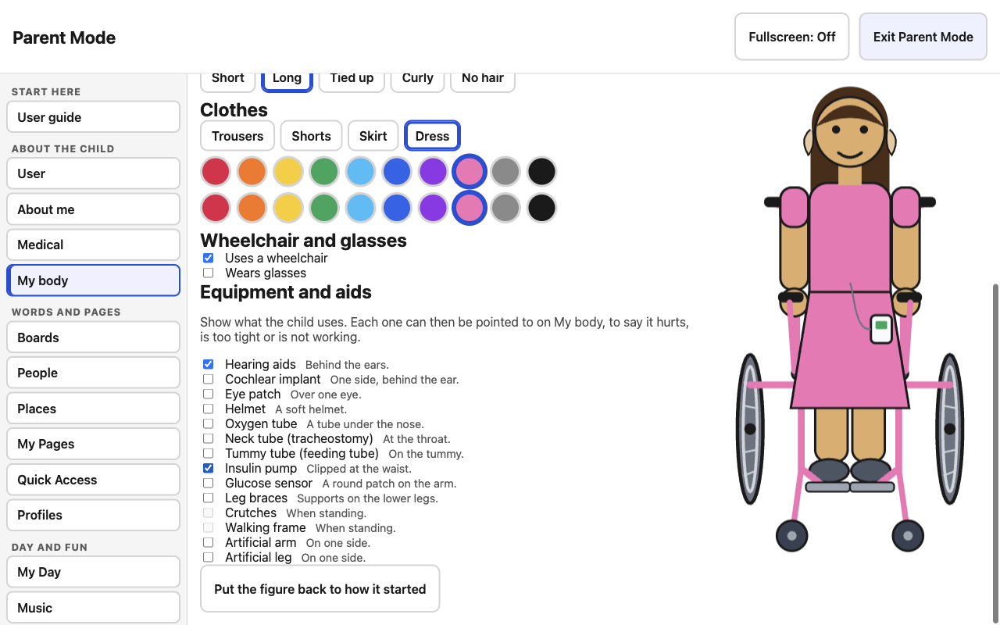

- **Figure**: **Boy**, **Girl** or **Non-binary**. Choosing one picks hair and clothes to start from; change any of them. The hair styles and head coverings are shown as small heads, so you can see what you are choosing.
- **Skin** (eight tones), **hair** (ten colours, and short, long, tied up, curly or none), **clothes** (trousers, shorts, skirt or dress, and colours for the top and the bottom).
- **Head covering.** None, a **hijab** (a headscarf worn by many Muslim women and girls), a **turban** (worn by many Sikh men and boys, and by others) or a **kippah** (a small cap worn by many Jewish men and boys, also called a yarmulke), in any of the clothes colours. A hijab or a turban covers the hair; a kippah sits on top of it. The face is always left clear.
- **Wheelchair and glasses.** The figure sits in a wheelchair, drawn with its big wheels, push rims, seat, handles, arm pads, footplates and small front wheels.
- **Equipment and aids**: hearing aids, cochlear implant, eye patch, helmet, oxygen tube, neck tube (tracheostomy), tummy tube (feeding tube), insulin pump, glucose sensor, leg braces, crutches, walking frame (only when standing), artificial arm, artificial leg. Each one that is shown can be pointed to on My body.

A live picture shows how it will look. It is always dressed. **Put the figure back to how it started** resets it.

### Boards

Edits the Talk board and its folders.

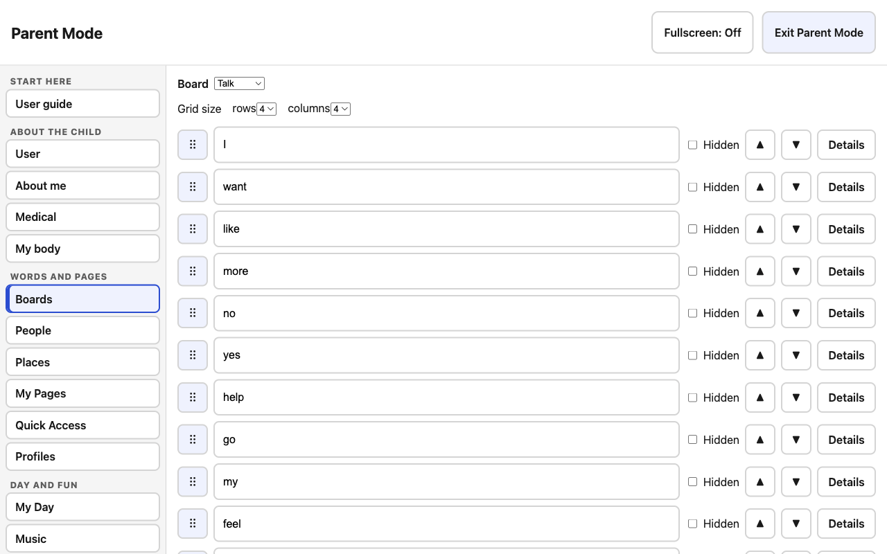

- **Board** (drop-down) chooses which board to edit: Talk, Food, Drinks, Feelings, and so on, plus any folders you add.
- **Grid size** (rows and columns, 2 to 5). It will not shrink below the number of buttons already placed, and says so; hide or move some first. Changing it re-packs buttons, so do it rarely.
- **Each button** is a row. Edit its **label**; tick **Hidden** to remove it from the child's board; reorder with the **drag handle** (the dotted square on the left) or the **▲ ▼** buttons; press **Details** for everything else (below).
- **Add button**: type a label, choose an emoji and a colour (by the kind of word: *people, doing words, describing words, things, places, social words, little words, no and stop*), or add a **photo** instead of an emoji (**Use camera** or **Import photo**). It goes in the first empty slot. If the board is full, it tells you to resize or hide something.
- **Add folder** (categories): type a name, choose an emoji and colour. This creates a new, empty board *and* a button that opens it. Pick the new folder in the **Board** drop-down to fill it with words.
- **Put this board back to the starter version** puts a built-in board back exactly as it came, after asking.
- **Add the newer starter words** appears on a device that has older starter pages. It adds the newer pages and words without moving anything you already have, and makes a page bigger only by adding empty places on the right and below.

**Details** (open it on any button) lets you set:

| Detail | What it does |
| --- | --- |
| **What it says** | If the button should say something different from its label: the label "Mum" can say "Mum, please". Empty means it says its label. |
| **Colour** | The kind of word, which sets the button colour. |
| **Picture** | An emoji, or a real **photo** of the real thing: the actual cup, the actual teacher. **Use an emoji instead** switches back. |
| **Recorded voice** | Record a familiar person saying it; their voice then speaks instead of the computer's. **Hear it** to check, **Remove the recording** to go back. |
| **Word stage** | **Always shown**, or stage 1 to 4. See [Learning](#learning). |
| **Focus word** | Gives the button a blue outline on the child's board. |
| **Remove this button** | Takes it off the board entirely (after asking). Its space stays empty, so nothing else moves. |

**Reordering by dragging.** Drag the handle of one button onto another and the two **swap places**. Nothing else moves. Use the **▲ ▼** buttons if you cannot drag (they work from a keyboard).

**Hiding or removing.** A hidden button disappears from the child's board but keeps its settings, and **Hidden** brings it back. Remove deletes it. Either way its slot stays empty so nothing else shifts.

### People and Places

Add the people and places that matter, as real, working buttons.

1. Open **People** (or **Places**) and fill in the name (and, for people, the relationship, such as "Mum" or "teacher").
2. Add a **photo** with **Use camera** and **Take photo**, or with **Import photo** to pick a picture from the computer. Big pictures are automatically made smaller. Real photos of the real person or place work best.
3. Optionally **Record voice clip** and speak the name: **a familiar voice will then say it instead of the computer voice.** Press **Stop recording** when done.
4. **Save person** (or **Save place**). A button appears on the **People** or **Places** board in Talk. **Hear name** lets you check it. **Remove** (after asking) takes the person or place and their button away together.
5. If you typed **phrases** for someone, **Make a page of these phrases** turns them into a My Pages page, ready to edit.

The first time you use the camera or microphone, the computer may ask permission; allow it.

### My Day

The day builder. Pick the **Date**, so you can plan ahead, and choose the **View** (Today, or Now / Next / Later).

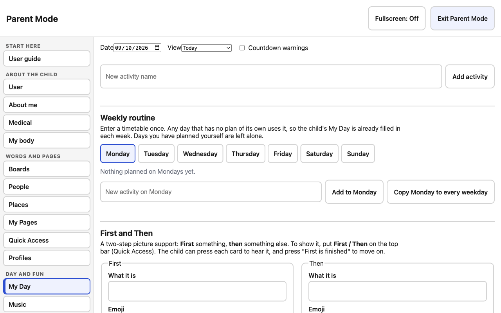

For each **activity** you can set a **name**, **time**, **location** and **who with**, and a **countdown** (none, 5 min, 30 min, or 1 hour). Open an activity's **picture** to give it an emoji. Reorder with **▲ ▼**, or **Remove** it. **Add activity** adds a new one.

- **Change of plan:** simply edit an activity's name. The child's screen shows the old name crossed out and speaks the change once.
- **Countdown warnings** is a checkbox, **off by default**. Turn it on only if a countdown helps this child.

**First / Then** (also on this tab) sets the two cards: what comes first, what comes then, each with an optional emoji. Put **First / Then** on the top bar from Quick Access for the child to use it.

**Weekly routine** (at the bottom of this tab). Enter a school timetable or a home routine **once**: choose a weekday, add its activities (name, time, location, who with), and **Copy Monday to every weekday** if the days are alike. Any day with no plan of its own then uses it, so the child's My Day is already filled in each week. Days you have already planned are never touched, and finishing an activity on the child's screen never alters the routine.

### My Pages (tab)

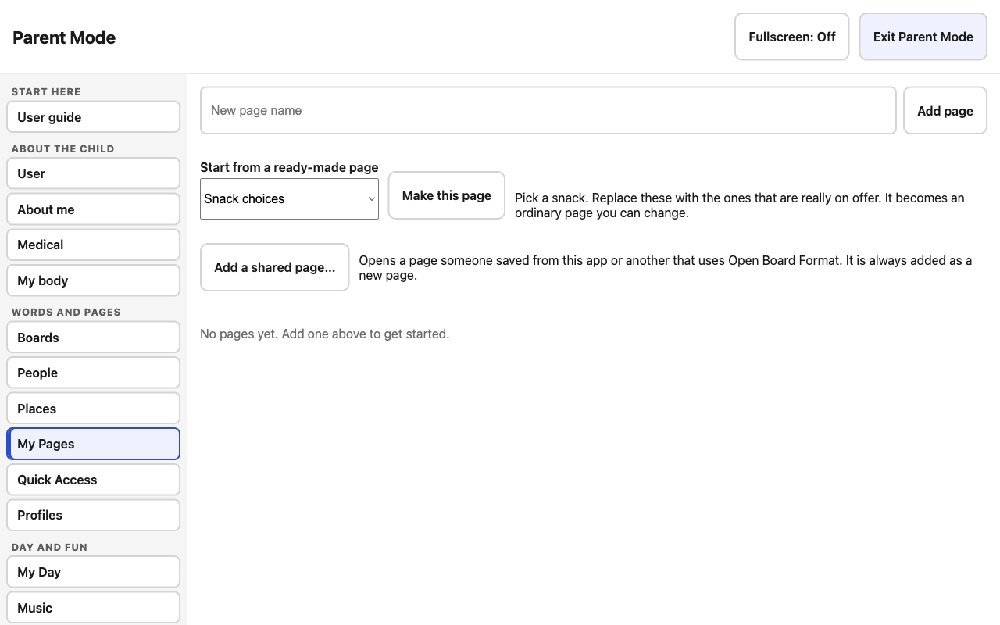

- **Start from a ready-made page**: choose a template and press **Make this page**. There are about thirty: *snacks, drinks, playground, classroom requests, hello and thank you, getting dressed, bedtime, café or shop, doctor or dentist, maths, science and nature, story time, PE and movement, art and making, lunchtime, assembly and quiet times, computers and tablets, working with a friend, feeling too much,* and one for each season and celebration (*Spring, Summer, Autumn, Winter, Christmas, Easter, Halloween, Bonfire Night, Diwali, Eid, Hanukkah*). It is added as a new page you can edit freely; check the words suit this child first.
- **Add page**: type a name. Pages appear in a list; pick one to edit it, **Rename** it, or **Delete** it (which deletes its buttons too).
- Each page works like a board: set the **grid size** (starts at 3 × 3), **add buttons** (emoji or photo), edit labels, open **Details**, **hide**, and reorder by dragging or with **▲ ▼**.
- **Share this page…** saves the page as a file (an **.obf** file, the open standard other communication software can read too). Photos and recordings are inside it. Give the file to another device on a USB stick or by email.
- **Add a shared page…** opens such a file. It is **always added as a new page**, never over one you have, and it says plainly if the file is not a page. A page bigger than 5 × 5 is refused. From other software, colours are not kept (colour here means the kind of word) and buttons that opened other boards become ordinary buttons.

### Quick Access

Choose what each of the six top-bar buttons does, from **Button 1** to **Button 6**:

- go to a screen: **Home, Help, Favourites, Keyboard, Talk, My Day, My Pages, Feelings, First / Then, Games, Draw, My body, Music** or **Traffic light**;
- speak straight away: **Yes, No, Break** ("I need a break"), **Question** ("I have a question"), **Toilet** ("I need the toilet"), **Finished** ("I've finished") or **Say again** ("Can you say that again, please?").

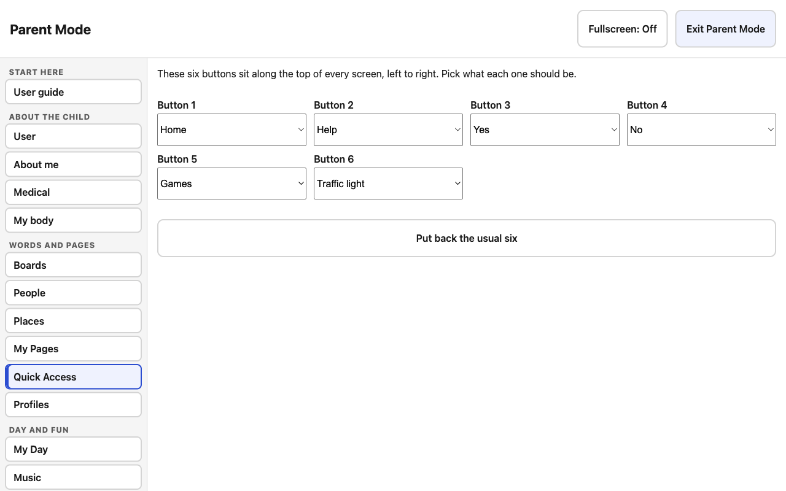

- Picking a button that is already on the bar **swaps** the two, so nothing appears twice.
- **Help can move, but cannot leave**, so it is always one press away. If you try to replace it, you are told why.
- **Put back the usual six** restores Home, Help, Yes, No, Favourites, Keyboard.

### Profiles

For using one device in different places: **Home, School, Grandparents, Hospital.** A profile only chooses **which page Talk opens to first** ("Opens to"). The vocabulary is the same everywhere, and the Home screen never changes. Press **Use this profile** to switch; the active one is marked **Active now**.

### Music

Add songs from files on this computer, such as **MP3**s (and M4A, WAV, OGG, FLAC and similar).

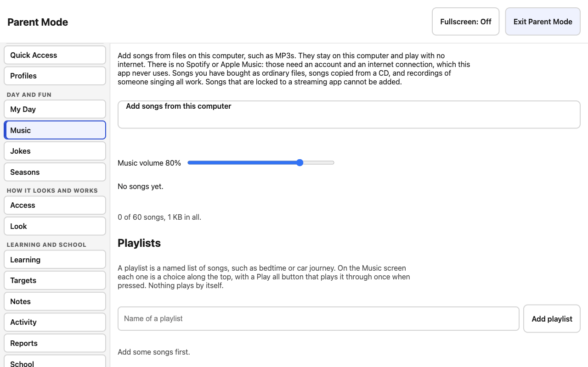

- **Add songs from this computer** opens the Windows file window. Each song keeps its file name as its name (tidied up); rename it, give it a picture, move it up or down, or **Remove** it.
- Up to **60 songs**, each up to **30 MB**. The page shows the total, and a reminder if the library is large, because a backup holds every song.
- **Music volume** is separate from the voice.
- **Playlists.** Below the songs, name a playlist (such as *Bedtime* or *Car journey*), choose a picture, and add songs to it from a list. Put them in order with **▲ ▼**, or **Take out** a song. Up to 12 playlists. On the child's Music screen each is a choice along the top, with a **Play all** button. Removing a song also takes it out of every playlist.
- Songs stay on this computer and play with no internet.

**There is no Spotify or Apple Music.** Those need an account and an internet connection, and this app never uses either. Songs you have bought as ordinary files, songs copied from a CD, and recordings of someone singing all work. Songs that are locked to a streaming app cannot be added.

### Jokes

The built-in jokes are in Games. Add your own here: a question and its answer. They are mixed in with the others and can be removed.

### Seasons (tab)

Which times of the year and celebrations the child sees in Games, Seasons, and the words in each. Everything starts as the usual set, and nothing changes until you change it.

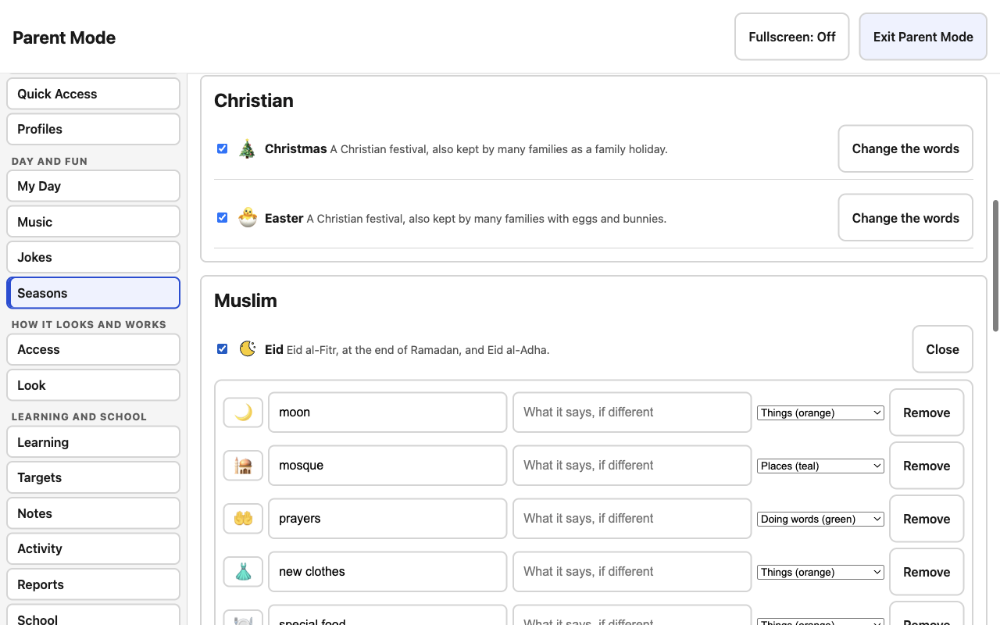

- **Choices grouped by tradition.** **The year**, **Christian**, **Muslim**, **Jewish**, **Hindu**, **Other celebrations** and **Your own**. Untick any that are not part of your family's life. A season that is left out leaves its place empty on the child's screen, so nothing else moves.
- **Change the words.** For any of them: change the word, the picture, what it says if that is different, and the kind of word (which sets its colour). Add a word, remove one, or **Put back the usual words**. Up to 12 words each. To choose a picture, open the computer's own emoji picker (on Windows press the Windows key and the full stop together; on a Mac press Control, Command and Space), then pick an emoji.
- **Add a celebration.** Choose one **from a list** (Ramadan, Vaisakhi, Holi, Passover, Chinese New Year, Birthday) or **name your own**. Up to 12. Remove one you added with **Remove**.
- **Put everything back to the usual.**

**A note on the words.** Eid covers Eid al-Fitr and Eid al-Adha; Diwali is also called Deepavali, and is kept by Hindus, Sikhs and Jains; Hanukkah is also spelled Chanukah. The words are a starting point. Only you know how your family keeps a celebration, so please read them and change anything that is not right. The ready-made My Pages pages for each season use the usual words, and are an ordinary page once made.

### Access

Settings for different ways of pressing buttons, and for how things sound and are read out. Everything starts off or neutral, and nothing changes until an adult changes it.

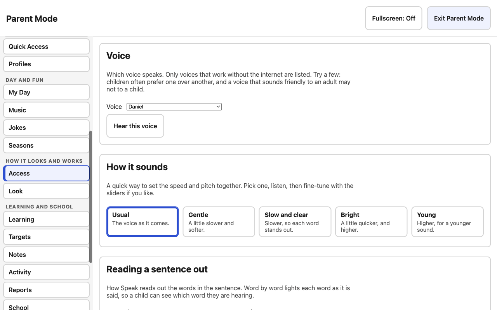

| Setting | What it does |
| --- | --- |
| **Voice** | Which voice speaks (offline voices only). **Hear this voice**. |
| **How it sounds** | One press sets speed and pitch together: **Usual, Gentle, Slow and clear, Bright, Young**. Then fine-tune with the sliders. |
| **Reading a sentence out** | **All together**, **with small gaps and a little slower**, or **one word at a time, lighting each word**. |
| **Speech rate** | How fast it speaks (0.5× to 1.5×). Some people follow slower speech better. |
| **Voice pitch** | How high or low the voice sounds (0.5× to 1.5×). |
| **Voice volume** | How loud the app speaks, on top of the computer's own volume (10% to 100%). |
| **Say it like this** | For a name or word the voice gets wrong: write it as it appears and as it should sound. Only the sound changes; the screen keeps the written spelling. **Hear it** lets you check. |
| **When a button is pressed** | On Talk and My Pages: **adds the word to the sentence**, **speaks the word straight away**, or **does both**. Opening a folder never speaks. |
| **Hold-to-select** | For eye gaze or a head pointer: a button activates once the pointer or focus has rested on it for this long (0 to 1.5 seconds), instead of on tap. **0 turns it off.** |
| **Repeat-press suppression** | Ignores a second press of the same button within this time (0 to 2 seconds), for a switch or a finger that sometimes double-fires. **0 turns it off.** |
| **Switch scanning** | Row-and-column scanning driven by **Space** and **Enter**, so any switch that acts like a keyboard works. **Two switches:** Space moves the highlight, Enter selects. **One switch:** Space selects, and the highlight moves on by itself (you choose how fast, 0.5 to 4 seconds). While scanning is on, buttons are reached by scanning rather than by touch. |
| **Keyboard letters** | Usual keyboard order, or alphabetical order (A, B, C…). |
| **Show each word's picture in the sentence** | Puts the button's picture beside each word in the sentence strip. |
| **High contrast** | Off, Light or Dark. When on, it is used instead of a colour scheme from Look. |
| **Text size** | 1× to 2×. At the larger sizes the buttons grow, so a board that no longer fits on the screen **scrolls**, and nothing is hidden. Buttons stay in the same order and place. |
| **Reduce motion** | For people who find movement difficult. (The app already avoids animation.) |
| **Low-arousal colours** | The same word-class colours, but muted, for a child overwhelmed by bright colour. |

With a **physical keyboard**, the arrow keys move around a board and **Enter** presses a button.

### Look

The pictures and colours of the whole app. Changes show straight away.

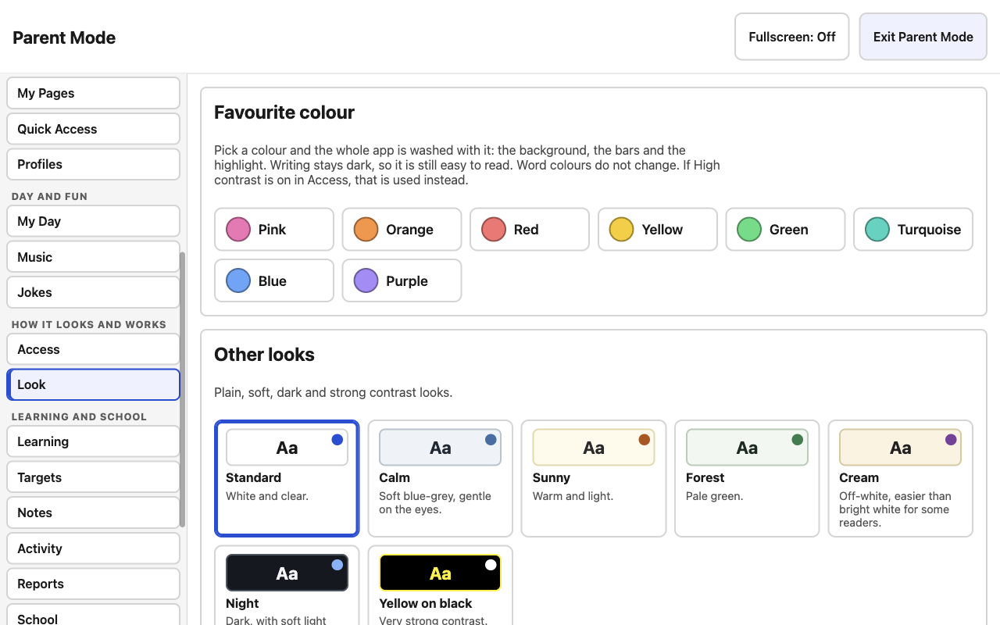

- **Pictures.** **Drawn symbols** (original, bold, simple pictures made for this app) or **Emoji**; and **picture and word**, **pictures only** or **words only**. A few sample buttons show the result. Words and pictures you add yourself are never changed, and an emoji with no drawing yet still shows as an emoji.

  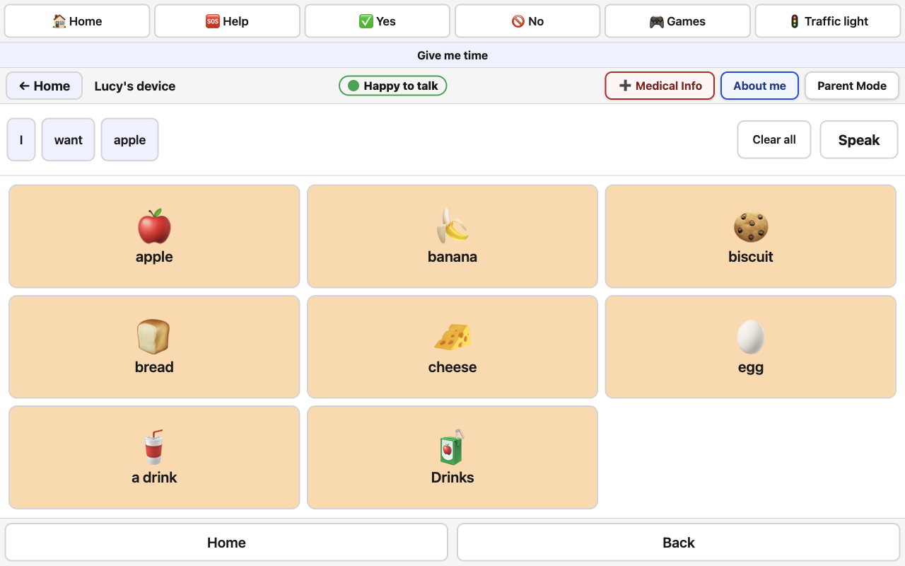

- **Favourite colour.** Pick **Pink, Orange, Red, Yellow, Green, Turquoise, Blue** or **Purple** and the whole app is washed with it (background, bars and highlight). Writing stays dark so it is easy to read, and word colours do not change.

  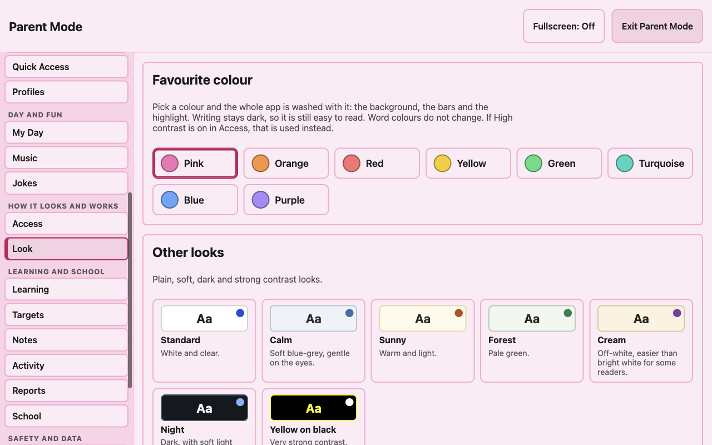

  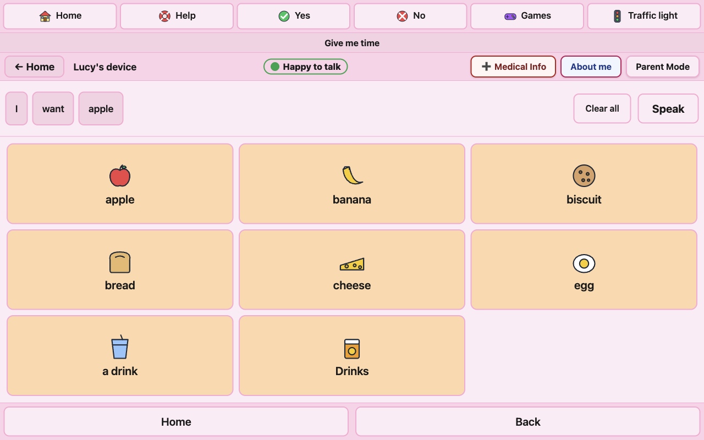

- **Other looks.** **Standard, Calm, Sunny, Forest, Cream, Night** (dark) and **Yellow on black**.
- **Make your own.** Choose the background, writing, outlines, bars and highlight. It says plainly if the writing would be hard to read.
- **Colours of the words.** Change the colour of any kind of word. It warns you when two look alike, because the colour is how a child learns what sort of word a button is.
- **Put everything back to the usual look.**

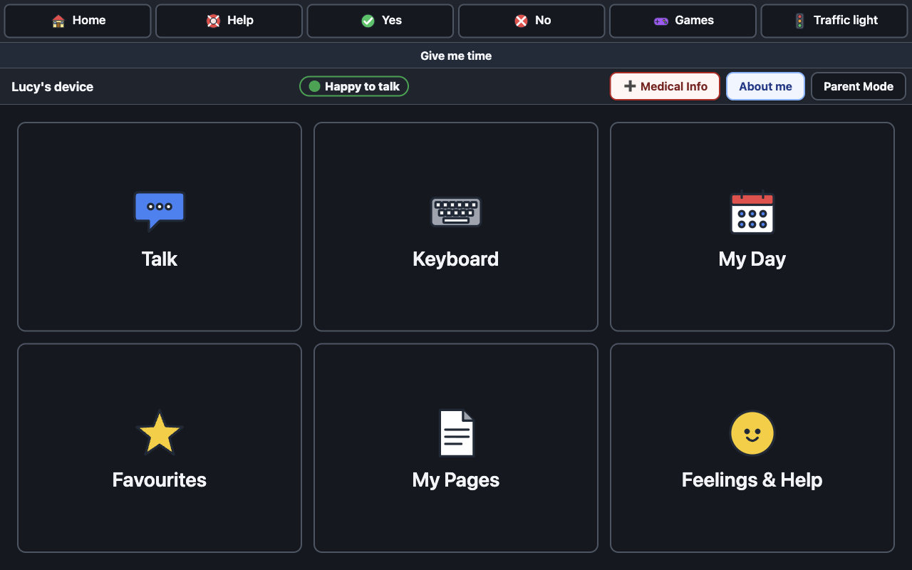

### Learning

For working with a speech and language therapist, or following their advice.

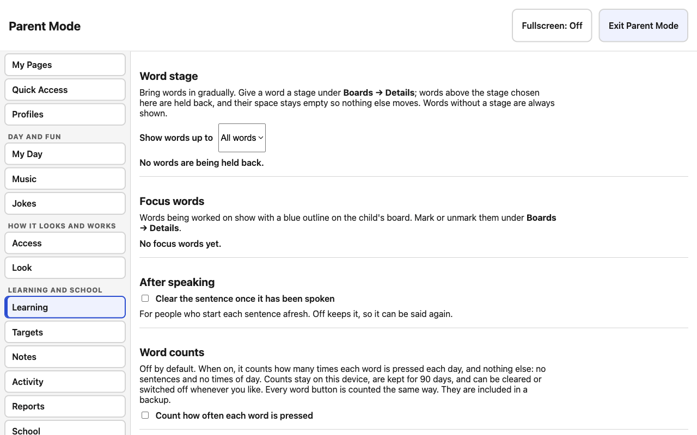

- **Word stage.** Bring words in gradually. Give a word a stage (1 to 4) in its **Details**; here choose **Show words up to** a stage. Words above it are **held back** (it tells you how many), their space stays empty, and they come back in exactly the same place when you move up. Words with no stage are always shown, and no word comes with a stage already set: which words belong in which stage is for you or a therapist to decide.
- **Focus words.** A list of the words marked as focus words, and the board each is on. They show with a blue outline on the child's board. Mark or unmark them in **Details**.
- **After speaking.** *Clear the sentence once it has been spoken* is for people who start each sentence afresh. Off, the sentence stays so it can be said again.
- **Word counts** (off by default). Counts how many times each word is pressed each day, **and nothing else**: no sentences and no times of day. Every word button is counted the same way, the Help phrases included. Counts stay on the device and are kept for 90 days. Switch it on, choose the last **7, 30 or 90 days**, and see the total, the most-pressed words, and the **words that were not pressed at all**, which is often the useful part. **Save the counts as a spreadsheet…** writes a `.csv` file you choose where to keep; **Clear the counts** deletes them (after asking); unticking the box stops counting at once. They are included in a backup.

### Backup

Save everything, or restore it, in **one file** that you control. Nothing is ever backed up automatically, anywhere.

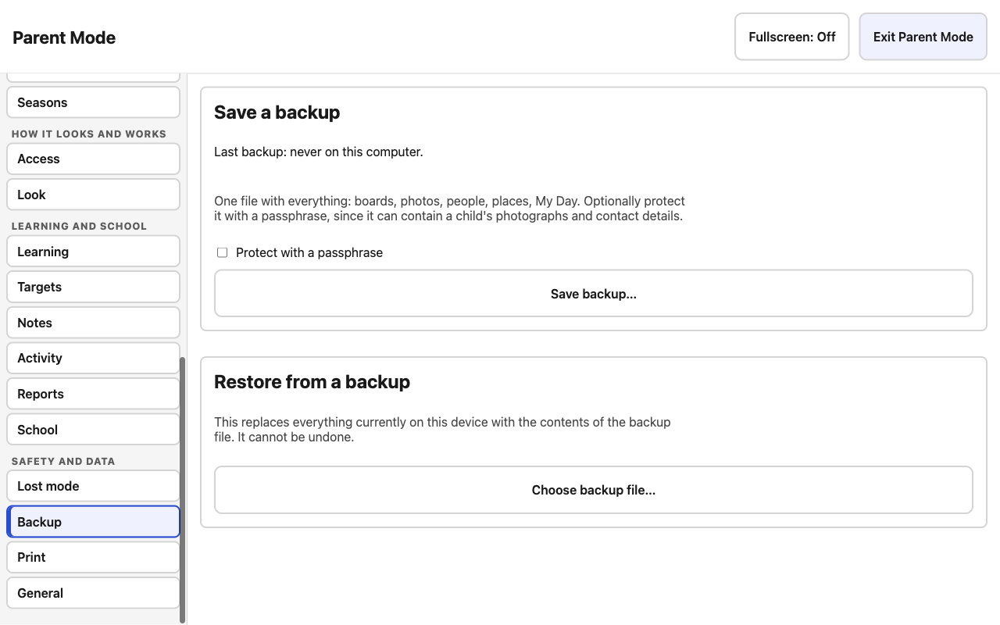

- It shows **when the last backup was made on this computer**, and Parent Mode reminds you if there has been none for a month and there is something worth protecting.
- **Save a backup** saves boards, photos, recorded voices, songs, people, places, My Day, the weekly routine, About me, Medical, targets, notes, drawings, settings and more as a `.mwbackup` file. The **activity log is not included**. **Tick "Protect with a passphrase"** and enter it twice. **This is strongly recommended**: the file contains the child's photographs and contact details. **A lost passphrase cannot be recovered.**
- **Restore from a backup** replaces **everything** on the device with the backup's contents, including the PIN. It asks you to confirm, and **cannot be undone**. Restoring on a different computer gives you an identical copy.

Keep backups somewhere safe, and do one after you have set things up and whenever you add photos.

### Print

For laminated cards that still work when the computer is broken, charging, or somewhere else. Choose **Board cards** (pick the board and a size: **20, 30, 50 or 70 mm**), a **Sentence strip template** (blank boxes to put cards in), or a **Visual schedule for a day** (the day's activities as numbered cards with times). Press **Print**; the computer's own print window opens with a preview first. Hidden buttons are left out. Printed cards come out at the stated size, so you can check one with a ruler, and show drawn symbols or emoji to match the choice in Look.

### General

- **Start when the computer starts.** Off by default. When on, the app opens automatically after sign-in (a Mac's login items, or Windows' start-up).
- **Close Parent Mode after…** Never, or 5, 10, 15, 30 or 60 minutes without use, so a shared or unattended device is not left open. Any press, key or typing counts as use, and the PIN is needed again to get back in.
- **Change the PIN.** Choose a new 4-digit PIN (twice). You get a **new recovery code, and the old one stops working**, so write it down.
- **Favourites.** The words saved to Favourites, each with a **Remove** button.

### Lost mode (tab)

For when the device goes missing.

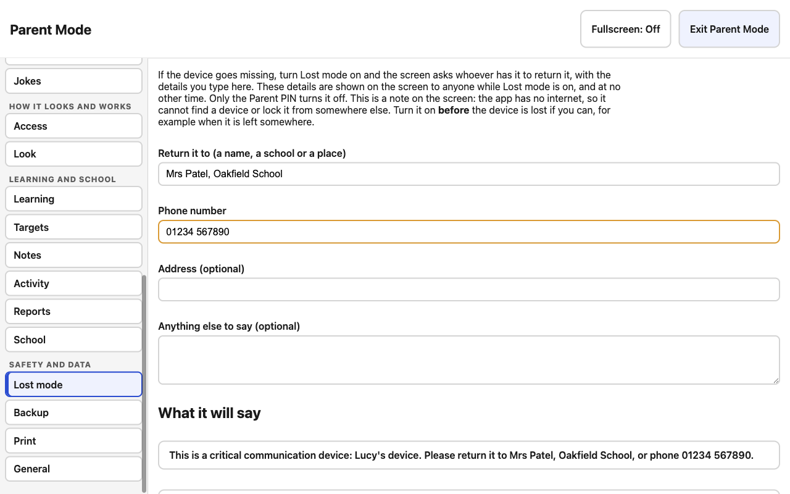

1. Type who to return it to (a name, a school or a place), a **phone number**, and an **address** if you wish, and anything else to say. If you have filled in the school ([School](#school)), **Use the school** fills these in.
2. Check **What it will say**.
3. Press **Turn Lost mode on**. It needs at least a name, a number or an address.

The screen is then covered until the **Parent PIN** is entered. The details are shown to anyone while Lost mode is on, and at no other time. **This is a note on the screen, not a tracker.** The app has no internet, so it cannot find a device or lock it from somewhere else. Turn it on **before** the device is lost if you can, for example when it is left somewhere.

---

## 7. School Mode

**School Mode** is a second, separate side of the app for the adults at school: its own button, its own **School PIN**, its own menu and its own look. It sits next to **Parent Mode** on the child's screen once it has been switched on. It is still one device and one pupil, with no pupil accounts and no class lists.

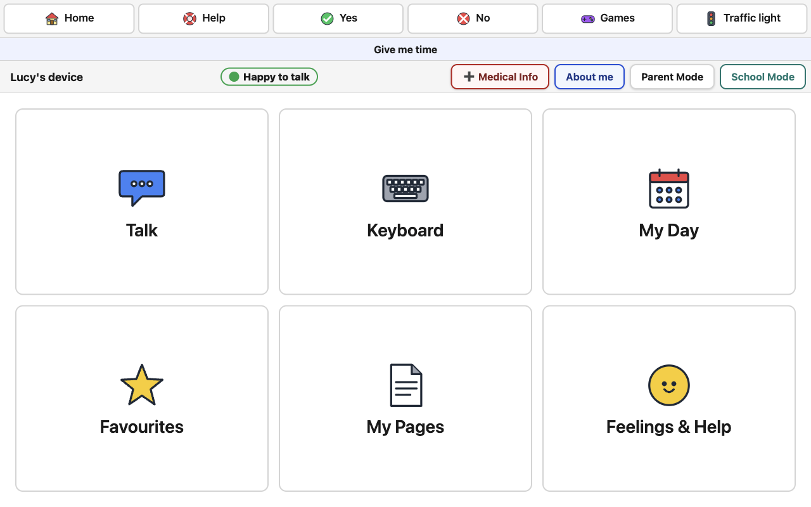

### Switching it on (Parent Mode, School)

School Mode is **not** part of the first set-up. Whoever has the Parent PIN switches it on afterwards:

1. In **Parent Mode**, open **School** and press **Turn School Mode on…**
2. Choose a **four-digit School PIN** and enter it twice. It is **not** the Parent PIN, and it has no recovery code.
3. A **School Mode** button now appears beside **Parent Mode** on every screen. Nothing on the child's screen moves.

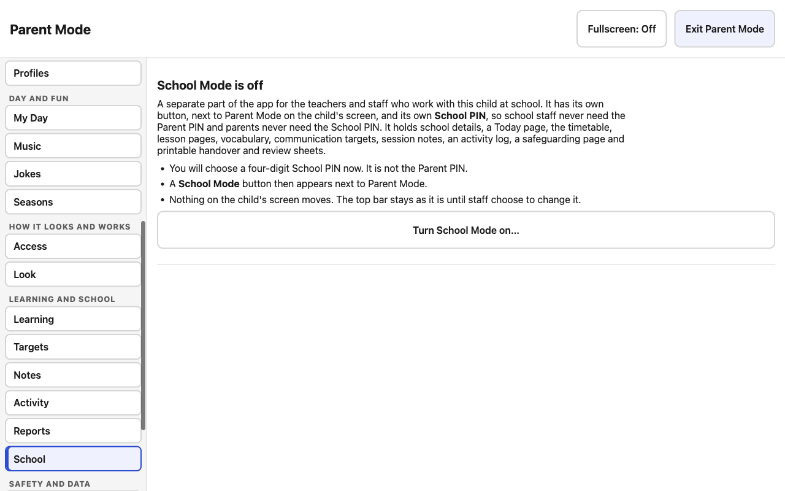

- **Choose a new School PIN** replaces it. This is also the way back in if staff forget it.
- **Turn School Mode off** hides the button. The School PIN and everything written is kept.
- **Forget the School PIN** (only while School Mode is off) removes the PIN as well, after asking.

Five wrong School PINs in a row make the keypad wait, exactly as the Parent PIN does, and the two are counted separately.

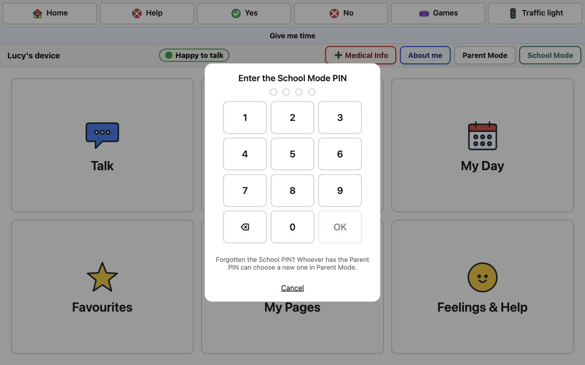

School Mode closes itself after **10 minutes** without use (change it in Classroom set-up).

### What is in School Mode

A menu down the left, in groups:

- **Today**: the date, today's timetable, targets being worked on and any due for review, use of the device today (if the activity log is on), the traffic light, the latest notes, and a **quick note** box.

  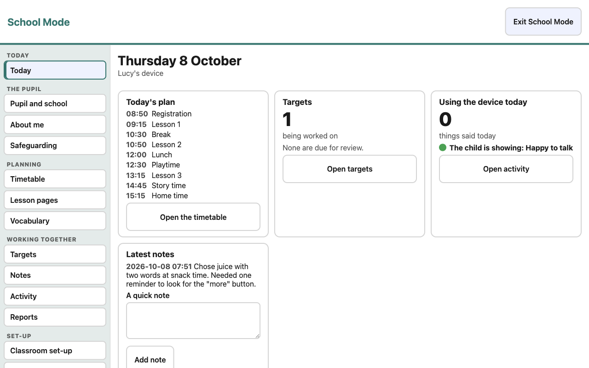

- **Pupil and school**: the school, class, class teacher, key adult, SENCo, speech and language therapist and school phone. For adults only. It fills the handover sheet and can fill in Lost mode.

  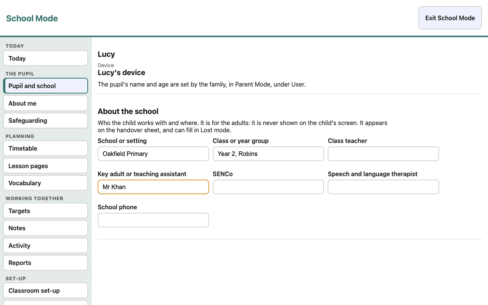

- **About me**: the one-page communication passport.
- **Safeguarding**: what to do if a child tells you something, the **designated safeguarding lead** and their phone number, and a plain account that the device does not record or report anything.

  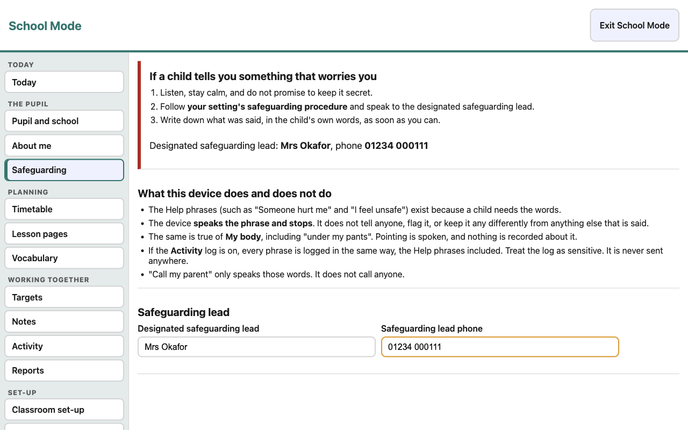

- **Timetable**: the week, changes of plan, and First / Then.

  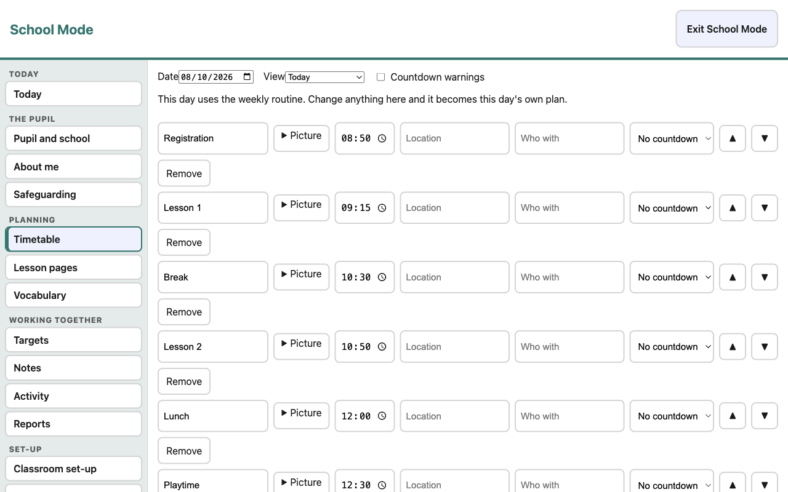

- **Lesson pages**: ready-made pages for lessons (maths, science, story time, PE, art, computers, lunchtime, assembly, working with a friend, feeling too much, classroom requests and more), plus all of My Pages. Pages can be shared as a file.

  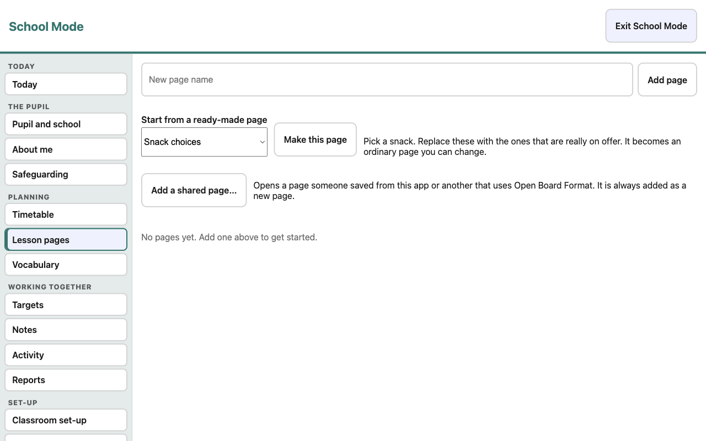

- **Vocabulary**: word stages and focus words, for working with the speech and language therapist.

  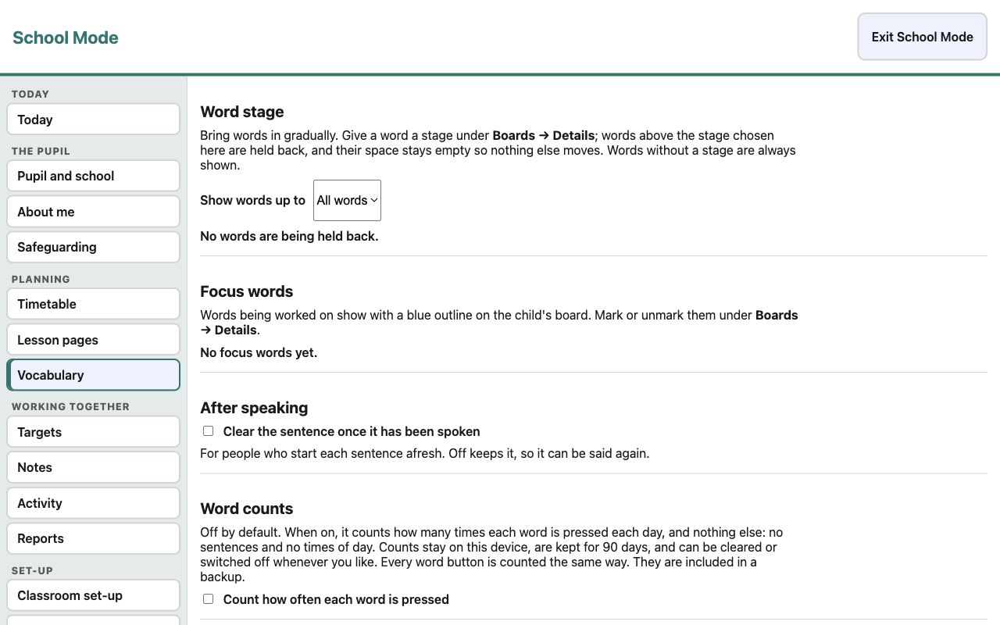

- **Targets**, **Notes**, **Activity** and **Reports**: described below. Parent Mode has these too.
- **Classroom set-up**: **Use the school top bar** (Home, Help, Yes, No, Break, Question, and Talk opens to the School page; it asks first because it moves buttons), **Start from a typical school day** (a Monday to Friday timetable, never replacing one you have), **Close School Mode after**, and **Choose a new School PIN**.

  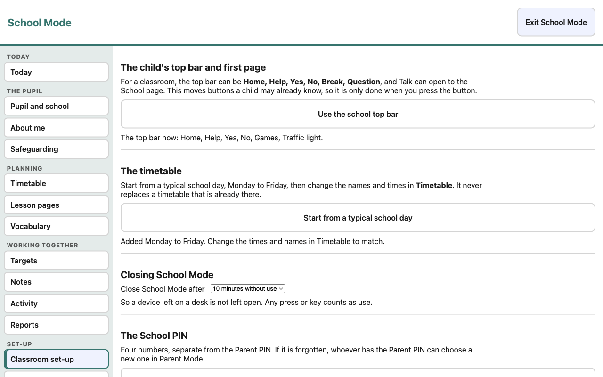

- **School guide**: this guide, inside School Mode, opening at the staff pages.

  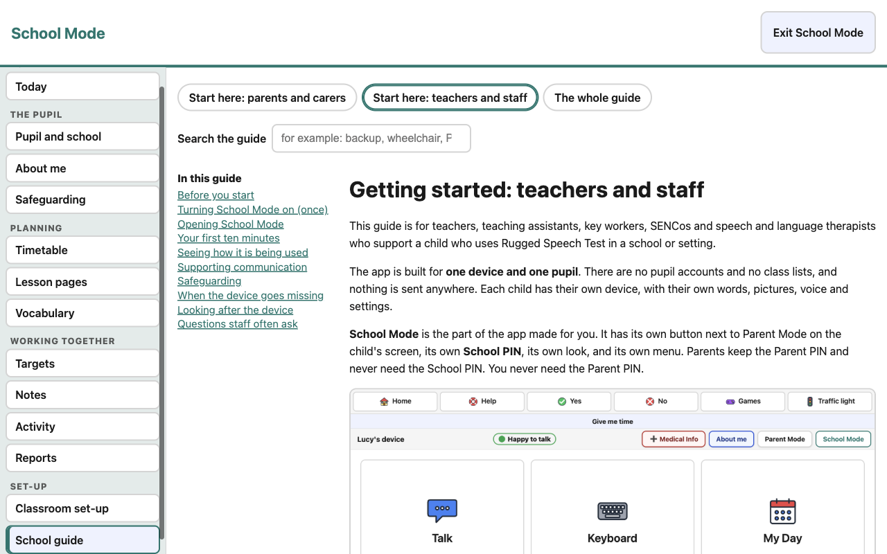

### Targets

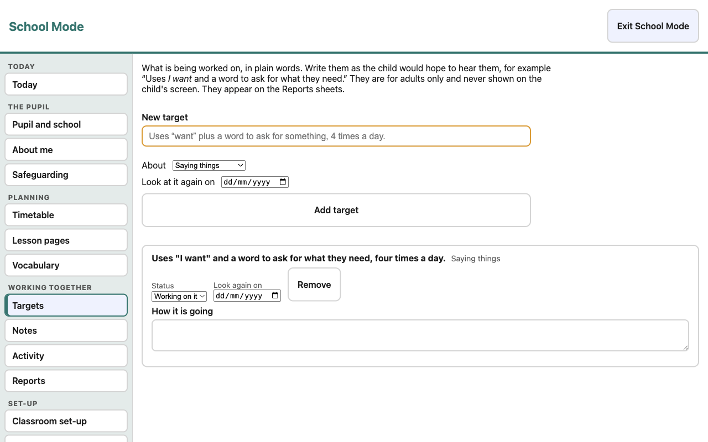

What is being worked on, in plain words. For each: what it is about (*saying things, understanding, talking with others, using the device, something else*), a **status** (working on it, achieved, paused), a review date and notes on how it is going. A target that is due is marked. Working targets come first. Adults only.

### Notes

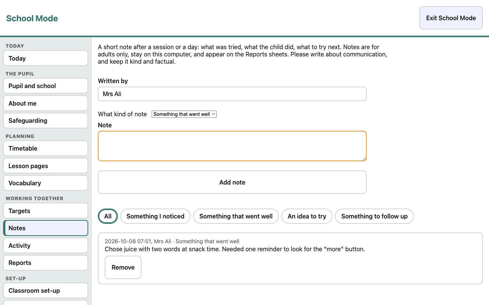

A few kind, factual lines after a session or a day, with who wrote them and when. Each has a kind (*something I noticed, something that went well, an idea to try, something to follow up*), and you can show just one kind. Newest first. Removing one asks first. Adults only.

### Activity

An optional log of what was said and which parts of the app were opened, with the time. **Off until you turn it on.**

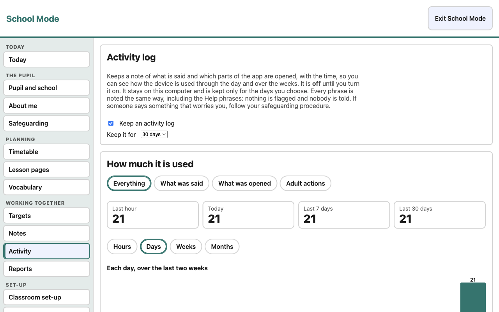

- **Keep an activity log** and **Keep it for** 7, 30, 90 days or a year. The oldest is forgotten first, and never more than 20,000 entries.
- **How much it is used**: totals for the **last hour, today, the last 7 days and the last 30 days**, and bars by the **hour, day, week and month**. Show **everything**, **what was said**, **what was opened** or **adult actions**.
- **Said most, last 30 days.** And **the log** itself, newest first.
- **Save as a spreadsheet** is the only way it leaves the device. **Clear the log** empties it, after asking.
- Every phrase is logged the same way, **the Help phrases included**. Nothing is flagged and nobody is told. What is said in games (practice) is not logged. The log is not part of a backup.

### Reports

Two sheets to print, or to save as a PDF from the print window. Nothing is sent anywhere.

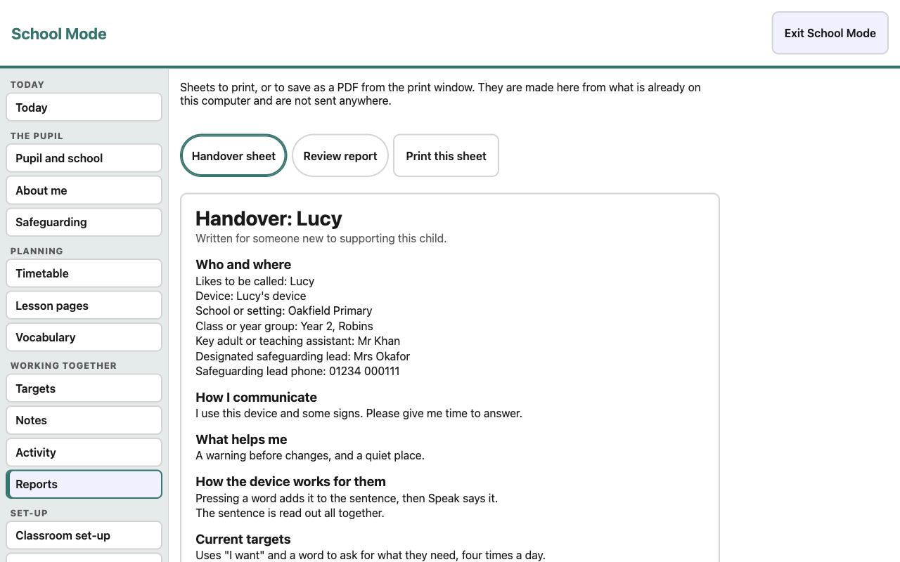

- **Handover sheet**: who and where, how the child communicates, what helps, how the device works for them, words being practised, current targets, what the traffic light means, and what is good to know. For supply staff and new staff.
- **Review report**: for a review meeting. Targets, how the device was used, the words most said, and the notes, over the last 30, 90, 180 or 365 days.

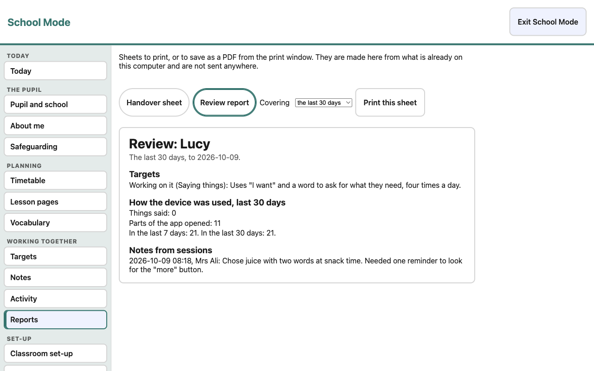

---

## 8. Setting it up well

A sensible order for a new child:

1. **Install and do the first-run steps.** Write the recovery code down.
2. **Fill in User and Medical**, and, if you want, **People** and **Places** with real photos of the people and places that matter.
3. **Make My body look like the child**, with any equipment they use.
4. **Hide** the words the child does not need yet. A smaller, calmer board is often easier. You can bring words back any time.
5. **Add folders and words** the child reaches for that are not there, in **Boards** or **My Pages**, using real photos where they help. Use **Details → What it says** where a label should say more.
6. **Choose Quick Access** buttons to suit how this child uses it.
7. **Build tomorrow in My Day** if routine helps. Leave **Countdown warnings** off unless you know they help.
8. **Check Access settings** with the child: what a press does, voice, speed and pitch, dwell or scanning.
9. **If a school will use it,** turn on **School Mode** under **School**, and choose a separate **School PIN** for the staff. Do this after the family has set things up, not during the first-run steps.
10. **If you are working with a therapist,** set **word stages** and **focus words** under Learning, and switch on **word counts** or the **Activity** log if it will help your review.
11. **Save a backup**, with a passphrase.
12. **Print a set of cards**, and the **About me** page, for when the computer is not available.

**Change things slowly.** Once a child has learned where a button is, that is hard-won. Add and hide rather than rearranging, and avoid resizing the grid once it works.

**Model it.** Press the buttons yourself as you talk, so the child sees how it is used. **Wait** after you speak.

**A speech and language therapist** should review the starter words and the phrases before a child relies on them. Which words matter is a clinical decision, and this app does not make it for you.

---

## 9. Privacy, safety and security

- **Nothing leaves the device.** There is no account, no cloud and no internet connection used. The only way anything leaves is a file an adult chooses to save: a backup, a shared page, a spreadsheet, a report.
- **Recent history is off by default**, is limited to the last 50 things said for at most 7 days, and can be cleared or switched off by an adult at any time. **The activity log** and **word counts** are also off by default, and have their own retention, clear button and off switch.
- **About me and Medical Info are visible without the PIN** on purpose, so a stranger or a new member of staff can read them. Only write what you are comfortable with them reading.
- **Help is not a safeguarding record.** Phrases such as "Someone hurt me" and "I feel unsafe" exist because a child needs the words. The app speaks the phrase and stops. It does not log it differently, flag it, or tell anyone, and nobody is notified. **A disclosure is handled by an adult following their setting's safeguarding procedure.** If you are in a school or similar setting, agree your approach in writing *before* the Help section is used. The same is true of **My body**.
- **"Call my parent" does not call anyone.** It speaks those words so a nearby adult can act.
- **If you deploy this in a school,** the app holds photographs of a child and their family, an emergency contact, medical details and potentially a record of what they said. You will probably need a **Data Protection Impact Assessment (DPIA)**.
- **Security.** The app is built so that nothing can reach the internet: every request outside the app is refused, the page is allowed to load only the app's own files, and it has no access to the computer beyond a few fixed, checked actions. The Parent PIN and recovery code are stored scrambled (salted hashes), not as typed. The full account, including what has been checked and what has not, is in [the security notes](security.md).
- **The PIN is not device security.** A four-digit PIN keeps a child out of the settings. It cannot stop someone who can copy the computer's files. Use Windows sign-in, and disk encryption such as BitLocker where it is available, to protect the device itself.

---

## 10. If something goes wrong

| Problem | What to do |
| --- | --- |
| **Windows says "Windows protected your PC"** when installing | Click **More info**, then **Run anyway**. It appears because the installer is not yet signed with a paid certificate. |
| **I've forgotten the PIN** | On the PIN screen press **Forgotten your PIN?** and enter the recovery code. |
| **I've lost the PIN *and* the recovery code** | There is no way back in, and no one can recover it. You would need to uninstall (choosing to delete the data) and set up again, so keep that code safe. |
| **The keypad says to wait** | Too many wrong PINs in a row. Wait for the time shown, then try again. It also stops a child pressing numbers at random. |
| **The app closed unexpectedly** | Reopen it. The sentence in progress and the page you were on are restored. |
| **No voices to choose in the first-run step** | Only voices that work offline are offered. Install a Windows speech voice (Settings → Time & Language → Speech), then reopen the app. |
| **There is no sound** | Turn up the computer's volume, then **Access → Voice volume** and **Voice**. Press **Hear this voice**. |
| **The voice is too fast, slow, high or low** | Parent Mode → **Access → How it sounds**, or the speed and pitch sliders. |
| **A button seems to do nothing** | If **Hold-to-select** is on, a button needs the pointer to rest on it, not a tap. If **Switch scanning** is on, buttons are reached by scanning. Check **Access**. |
| **A button has disappeared** | It may be hidden. Parent Mode → **Boards** → untick **Hidden**. |
| **A word has gone from the board, leaving a gap** | It is hidden, or held back by a **word stage**. Check **Boards → Details** and **Learning**. Everything else stays where it was. |
| **The pictures look like emoji (or like drawings) and I want the other** | Parent Mode → **Look → Pictures**. |
| **The camera does not work** | Allow camera access if Windows asks. Otherwise use **Import photo**. |
| **A song will not play** | It may not be a sound file this computer can play, or it was locked to a streaming app. Try an MP3. |
| **The piano makes no sound** | Check the computer's volume and **Music volume**. |
| **Can't add a button: "No empty slot"** | The board is full. Resize the grid or hide a button first. |
| **I can't shrink the grid** | It will not shrink below the number of buttons already placed. Hide or move some first. |
| **Parent Mode closed by itself** | It closes after the time set in **General** without use. Enter the PIN to come back in. |
| **Everything is covered by a red message** | Lost mode is on. Press **Owner: turn off** and enter the PIN. |
| **The QR code will not scan** | Hold the phone 20 to 30 centimetres away, steady, with the whole code in view, and turn the screen brightness up. |
| **Restoring a backup said the passphrase was wrong** | Check the passphrase exactly (it is case-sensitive). There is no recovery for a lost passphrase. |
| **The computer sleeps in the middle of use** | The app keeps the screen awake while it is the active window. Check Windows' own power settings if it is still sleeping. |

---

## 11. Quick reference

**Top of every screen:** Quick Access bar (Help always there) · Give me time · Home · Medical Info · Parent Mode.

**Home tiles:** Talk · Keyboard · My Day · Favourites · My Pages · Feelings & Help.

**Feelings & Help tabs:** Feelings · Help · Calm · My body.

**Games:** Find the word · Snap · Rollercoaster · Draw · Jokes · Music · Piano · Seasons · Make a tree.

**School Mode** (once switched on, next to Parent Mode, with its own PIN): Today · Pupil and school · About me · Safeguarding · Timetable · Lesson pages · Vocabulary · Targets · Notes · Activity · Reports · Classroom set-up · School guide.

**Parent Mode:** User guide · User · About me · Medical · My body · Boards · People · Places · My Pages · Quick Access · Profiles · My Day · Music · Jokes · Seasons · Access · Look · Learning · Targets · Notes · Activity · Reports · School · Lost mode · Backup · Print · General.

**Gestures**

| To… | Do this |
| --- | --- |
| Add a word to the sentence | Press it (when pressing adds to the sentence) |
| Say the sentence | Press **Speak** |
| Remove one word | Press it in the sentence strip |
| Add a button to Favourites | Hold it down until you hear "Added to Favourites" |
| Swap two buttons (adult) | Drag one handle onto the other, in Parent Mode |
| Play the piano from a keyboard | **A S D F G H J K** |

**Favourite colours:** Pink · Orange · Red · Yellow · Green · Turquoise · Blue · Purple (Parent Mode, Look).

**Colours of the words**

| Kind of word | Colour |
| --- | --- |
| People | Yellow |
| Doing | Green |
| Describing | Blue |
| Things | Orange |
| Places | Teal |
| Social | Pink |
| Little words | Purple |
| No and stop | Red |
